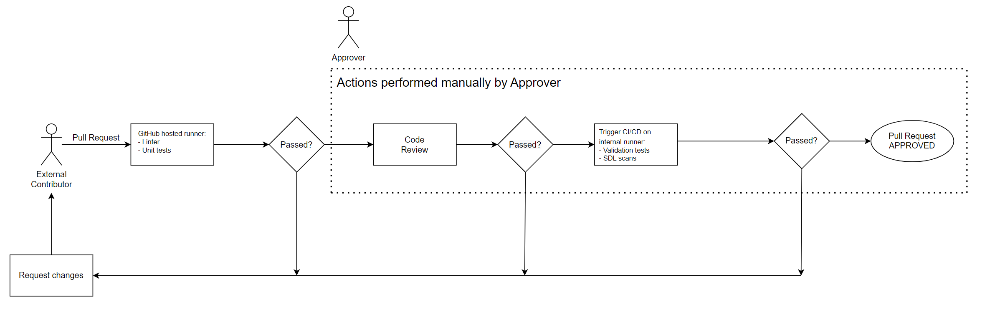
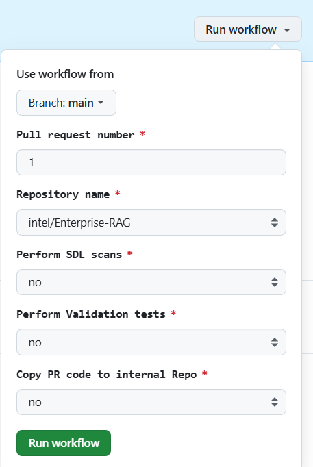

# Verify External PR

## Approval process Diagram

## Follow the steps to verify external PR

### 1. Go to [Enterprise RAG public repository](https://github.com/intel/Enterprise-RAG)

### 2. Find a number of pull request to be verified

### 3. Go to [External PR verify workflow](https://github.com/intel-innersource/applications.ai.enterprise-rag.enterprise-ai-solution/actions/workflows/verify-external-pr.yml)

### 4. Fill in dropdown list to run workflow against specified PR code:
note: Use workflow from the release branch, corresponding to public release, into which you want to merge pull request

### 5. Run workflow and verify its output
