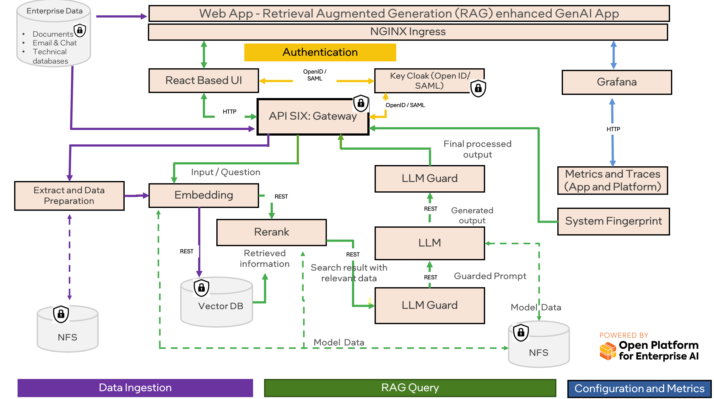

# Intel® AI for Enterprise RAG

Intel® AI for Enterprise RAG simplifies transforming your enterprise data into actionable insights. Powered by Intel® Xeon® processors and Intel® Gaudi® AI accelerators, it integrates components from industry partners to offer a streamlined approach to deploying enterprise solutions.

## Why use Intel® AI for Enterprise RAG?

Enable intelligent ChatQ&A experiences that understand your business context:

* **Domain-Specific Intelligence** - Enrich conversations with your organizational knowledge without training or fine-tuning models
* **Rapid Deployment** - Transform enterprise documents into conversational AI experiences in minutes, not months
* **Enterprise-Ready Scale** - Deploy secure, compliant ChatQ&A solutions that grow with your business needs

## Core Features
* **One-Click Enterprise Deployment** - Fully automated Kubernetes cluster provisioning with Ansible playbooks, supporting both single-node and multi-node configurations with comprehensive infrastructure setup.
* **Optimized AI Hardware Support** - Native support for Intel® Xeon® processors and Intel® Gaudi® AI accelerators with Horizontal Pod Autoscaling (HPA), balloons policy for CPU pinning on NUMA architectures, and performance-tuned configurations.
* **Enterprise-Grade Security & Compliance** - Integrated Identity and Access Management (IAM) with Keycloak, programmable guardrails for fine-grained control, Pod Security Standards (PSS) enforcement for secure enterprise operations, role-based access control for vector databases, and Intel® Trust Domain Extensions (TDX) support for confidential computing.
* **Comprehensive Monitoring & Observability** - Integrated telemetry stack with Prometheus, Grafana dashboards, distributed tracing with Tempo, and centralized logging with Loki for full pipeline visibility.

If you're interested in getting a glimpse of how Intel® AI for Enterprise RAG works, check out following demo.

<br/>
<div align="center">
  <a href="https://www.youtube.com/watch?v=wWcUNle1kkg">
    
  </a>
</div>
&nbsp;

> [!NOTE]
> The video provided below showcases the beta release of our project. As we've transitioned to next releases, users can anticipate an improved UI design, improved installation process along with other enhancements.

Feel free to check out the architecture of the pipeline. For the detailed microservices architecture, refer [here](./docs/microservices_architecture.png).



# Table of Contents

1. [Intel® AI for Enterprise RAG](#intel-ai-for-enterprise-rag)
   - [Why use Intel® AI for Enterprise RAG?](#why-use-intel-ai-for-enterprise-rag)
   - [Core Features](#core-features)
3. [Requirements](#requirements)
   - [System Requirements](#system-requirements)
   - [Software Prerequisites](#software-prerequisites)
   - [Hardware Requirements](#hardware-requirements)
      - [Deployment on Xeon only](#deployment-on-xeon-only)
      - [Deployment on Xeon + Gaudi Accelerator](#deployment-on-xeon--gaudi-accelerator)
4. [Getting Started](#getting-started)
   - [Cluster preparation](#cluster-preparation)
      - [Simplified Single node Kubernetes Cluster Deployment](#simplified-single-node-kubernetes-cluster-deployment)
      - [Installing Infrastructure Components on a custom cluster](#installing-infrastructure-components-on-a-custom-cluster)
   - [Pipeline installation](#pipeline-installation)
5. [Documentation](#documentation)
6. [Support](#support)
7. [Publications](#publications)
7. [License](#license)
8. [Security](#security)
9. [Intel’s Human Rights Principles](#intels-human-rights-principles)
10. [Model Card Guidance](#model-card-guidance)
11. [Contributing](#contributing)
12. [Trademark Information](#trademark-information)


# Requirements

## System Requirements

| Category            | Details                                                                                                           |
|---------------------|-------------------------------------------------------------------------------------------------------------------|
| Operating System    | Ubuntu 22.04/24.04                                                                                                |
| Hardware Platforms  | 4th Gen Intel® Xeon® Scalable processors<br>5th Gen Intel® Xeon® Scalable processors<br>6th Gen Intel® Xeon® Scalable processors<br>3rd Gen Intel® Xeon® Scalable processors and Intel® Gaudi® 2 AI Accelerator<br>4th Gen Intel® Xeon® Scalable processors and Intel® Gaudi® 2 AI Accelerator <br>6th Gen Intel® Xeon® Scalable processors and Intel® Gaudi® 3 AI Accelerator|
| Kubernetes Version  | 1.29.5 <br> 1.29.12 <br> 1.30.8 <br> 1.31.4                                                                        |
| Python              | 3.10                                                                                                               |

## Software Prerequisites
- **Hugging Face Model Access**: Ensure you have the necessary access to download and use the chosen Hugging Face model. Default models can be inspected in [config.yaml](deployment/inventory/sample/config.yaml).
- For **multi-node clusters** CSI driver with StorageClass supporting accessMode ReadWriteMany (RWX) is required. NFS server with CSI driver that supports RWX can be installed via [simplified kubernetes cluster deployment](#simplified-single-node-kubernetes-cluster-deployment) section or you can check out more detailed instructions in [deployment/README.md](deployment/README.md).

## Hardware Requirements

These are minimal requirements to run Intel® AI for Enterprise RAG with default settings. In case of more(or less) resources available, feel free to adjust the parameters in [resources-reference-cpu.yaml](deployment/pipelines/chatqa/resources-reference-cpu.yaml) or [resources-reference-hpu.yaml](deployment/pipelines/chatqa/resources-reference-hpu.yaml), depending on the chosen hardware.

### Deployment on Xeon only
To deploy the solution using Xeon only, you will need access to any platform with Intel® Xeon® Scalable processor that meet bellow requirements:
-  **logical cores**: A minimum of `88` logical cores
-  **RAM memory**: A minimum of `250GB` of RAM
-  **Disk Space**: `200GB` of disk space is generally recommended, though this is highly dependent on the model size

### Deployment on Xeon + Gaudi Accelerator

To deploy the solution on a platform with Gaudi® AI Accelerator we need to have access to instance with minimal requirements:

-  **logical cores**: A minimum of `56` logical cores
-  **RAM memory**: A minimum of `250GB` of RAM though this is highly dependent on database size
-  **Disk Space**: `500GB` of disk space is generally recommended, though this is highly dependent on the model size and database size
-  **Gaudi cards**: `8`
-  **Gaudi driver**: `1.21.3`

# Getting Started

Install the prerequisities.

```sh
cd deployment/
sudo apt-get install python3-venv
python3 -m venv erag-venv
source erag-venv/bin/activate
pip install --upgrade pip
pip install -r requirements.txt
ansible-galaxy collection install -r requirements.yaml --upgrade
```

Create a copy of the configuration file:

```sh
cd deployment
cp -r inventory/sample inventory/test-cluster
```

(Optional) Execute following command to install and configure third party applications, including Docker, Helm, make, zip, and jq, needed to run the Intel® AI for Enterprise RAG correctly.

```sh
ansible-playbook -u $USER -K playbooks/application.yaml --tags configure -e @inventory/test-cluster/config.yaml
```

## Cluster preparation

### Simplified Single node Kubernetes Cluster Deployment

If you need to deploy a new Kubernetes cluster or don't know where to start, follow the instructions below. If you already have a cluster prepared, skip to the [next](#installing-infrastructure-components-on-a-custom-cluster) section.

1. **Edit the inventory file:**
   - Open `inventory/test-cluster/inventory.ini`.
   - Replace `LOCAL_USER`, `REMOTE_USER` and `MACHINE_IP` with your actual values.

Example `inventory.ini` for a single-node cluster:
```ini
# Kubernetes Cluster Inventory
[local]
localhost ansible_connection=local ansible_user=LOCAL_USER

[all]
# Control plane nodes
node1 ansible_host=MACHINE_IP

# Define node groups
[kube_control_plane]
node1

[kube_node]
node1

[etcd:children]
kube_control_plane

[k8s_cluster:children]
kube_control_plane
kube_node

# Vars
[k8s_cluster:vars]
ansible_become=true
ansible_user=REMOTE_USER
ansible_connection=ssh
```

> [!TIP]
> For password SSH connections to the node, add `--ask-pass` to every ansible command.

For more information on preparing an Ansible inventory, see the [Ansible Inventory Documentation](https://docs.ansible.com/ansible/latest/inventory_guide/intro_inventory.html).

2. **Edit the configuration file:**
   - Open `inventory/test-cluster/config.yaml`.
   - Fill in the required values for your environment. If you don't have any cluster deployed, ignore `kubeconfig` parameter for now.


> [!NOTE]
> The inventory provides the ability to install additional components that might be needed when preparing a Kubernetes (K8s) cluster.
> * Set `gaudi_operator: true` if you are working with Gaudi nodes and want to install gaudi software stack via operator.
> * Set `install_csi: nfs` if you are setting up a multi-node cluster and want to deploy an NFS server with a CSI plugin that creates a `StorageClass` with RWX (ReadWriteMany) capabilities. [Velero](deployment/README.md#backup-functionality-with-vmware-velero) requires NFS to be included.
> * Set `install_csi: netapp-trident` if you are deploying with NetApp ONTAP storage backend for enterprise-grade storage with advanced features.

3. **(Optional) Validate hardware resources:**

   ```sh
   ansible-playbook playbooks/validate.yaml --tags hardware -i inventory/test-cluster/inventory.ini -e @inventory/test-cluster/config.yaml
   ```

If this is gaudi_deployment add additional flag -e is_gaudi_platform=true.

4. **Deploy the cluster:**

   ```sh
   ansible-playbook -K playbooks/infrastructure.yaml --tags configure,install -i inventory/test-cluster/inventory.ini -e @inventory/test-cluster/config.yaml
   ```

5. **Add `kubeconfig` path in config.yaml.**

6. **(Optional) Validate config.yaml:**

   ```sh
   ansible-playbook playbooks/validate.yaml --tags config -i inventory/test-cluster/inventory.ini -e @inventory/test-cluster/config.yaml
   ```


### Installing Infrastructure Components on a custom cluster

If you are using your own custom Kubernetes cluster (not provisioned by the provided infrastructure playbooks), you may need to install additional infrastructure components before deploying the application. These include the NFS server for shared storage, Gaudi operator (for Habana Gaudi AI accelerator support), Velero, or other supported services.

To prepare your cluster:

1. **Edit the configuration file:**
   - Open `inventory/test-cluster/config.yaml`.
   - Set `deploy_k8s: false` and update the other fields as needed for your environment.
   - If you need NFS, set `install_csi: nfs` and configure the NFS-related variables (backing up with [Velero](deployment/README.md#backup-functionality-with-vmware-velero) requires NFS to be included).
   - If you need Gaudi support, set `gaudi_operator: true` and specify the desired `habana_driver_version`.


2. **Validate hardware resources and `config.yaml`:**

   ```sh
   ansible-playbook playbooks/validate.yaml --tags hardware,config -i inventory/test-cluster/inventory.ini -e @inventory/test-cluster/config.yaml
   ```

If this is a Gaudi deployment, add the flag `-e is_gaudi_platform=true`.

3. **Install infrastructure components (NFS, Gaudi operator, or others):**

   ```sh
    ansible-playbook -K playbooks/infrastructure.yaml --tags post-install -i inventory/test-cluster/inventory.ini -e @inventory/test-cluster/config.yaml
   ```
   This will install and configure the NFS server, Gaudi operator, or velero as specified in your configuration.

> [!NOTE]
> You can enable several components in the same run if both are needed. Additional components may be supported via post-install in the future.

## Pipeline installation

Once your cluster is prepared and the required infrastructure is installed, proceed with the application installation.

```sh
ansible-playbook -u $USER -K playbooks/application.yaml --tags configure,install -e @inventory/test-cluster/config.yaml
```

To verify if the components were installed correctly, run the script [./scripts/test_connection.sh](./deployment/scripts/test_connection.sh), [connect to UI](deployment/README.md#access-the-uigrafana), or execute [e2e tests](src/tests/).

# Documentation

Refer to [deployment/README.md](deployment/README.md) or [docs](docs/) for more detailed deployment guide or in-depth instructions on ERAG components.

# Support

Submit questions, feature requests, and bug reports on the GitHub Issues page.

# Publications

Feel free to checkout articles about Intel® AI for Enterprise RAG:
* [NetApp AIPod Mini – Deployment Automation](https://community.netapp.com/t5/Tech-ONTAP-Blogs/NetApp-AIPod-Mini-Deployment-Automation/ba-p/463257)
* [Multi-node deployments using Intel® AI for Enterprise RAG](https://community.intel.com/t5/Blogs/Tech-Innovation/Artificial-Intelligence-AI/Multi-node-deployments-using-Intel-AI-for-Enterprise-RAG/post/1710214)
* [Rethinking AI Infrastructure: How NetApp and Intel Are Unlocking the Future with AIPod Mini](https://community.intel.com/t5/Blogs/Tech-Innovation/Artificial-Intelligence-AI/Rethinking-AI-Infrastructure-How-NetApp-and-Intel-Are-Unlocking/post/1705557)
* [Deploying Scalable Enterprise RAG on Kubernetes with Ansible Automation](https://community.intel.com/t5/Blogs/Tech-Innovation/Artificial-Intelligence-AI/Deploying-Scalable-Enterprise-RAG-on-Kubernetes-with-Ansible/post/1701296)
<br/>

------

# License

Intel® AI for Enterprise RAG is licensed under the [Apache License Version 2.0](LICENSE). Refer to the "[LICENSE](LICENSE)" file for the full license text and copyright notice.

This distribution includes third-party software governed by separate license terms. This third-party software, even if included with the distribution of the Intel software, may be governed by separate license terms, including without limitation, third-party license terms, other Intel software license terms, and open-source software license terms. These separate license terms govern your use of the third-party programs as set forth in the "[THIRD-PARTY-PROGRAMS](THIRD-PARTY-PROGRAMS)" file.

# Security

The [Security Policy](SECURITY.md) outlines our guidelines and procedures for ensuring the highest level of security and trust for our users who consume Intel® AI for Enterprise RAG.

# Intel’s Human Rights Principles

Intel is committed to respecting human rights and avoiding causing or contributing to adverse impacts on human rights. See [Intel’s Global Human Rights Principles](https://www.intel.com/content/dam/www/central-libraries/us/en/documents/policy-human-rights.pdf). Intel’s products and software are intended only to be used in applications that do not cause or contribute to adverse impacts on human rights.

# Model Card Guidance

You, not Intel, are responsible for determining model suitability for your use case. For information regarding model limitations, safety considerations, biases, or other information consult the model cards (if any) for models you use, typically found in the repository where the model is available for download. Contact the model provider with questions. Intel does not provide model cards for third party models.

# Contributing

If you want to contribute to the project, please refer to the guide in [CONTRIBUTING.md](CONTRIBUTING.md) file.

# Trademark Information

Intel, the Intel logo, OpenVINO, the OpenVINO logo, Pentium, Xeon, and Gaudi are trademarks of Intel Corporation or its subsidiaries.

Other names and brands may be claimed as the property of others.

&copy; Intel Corporation
