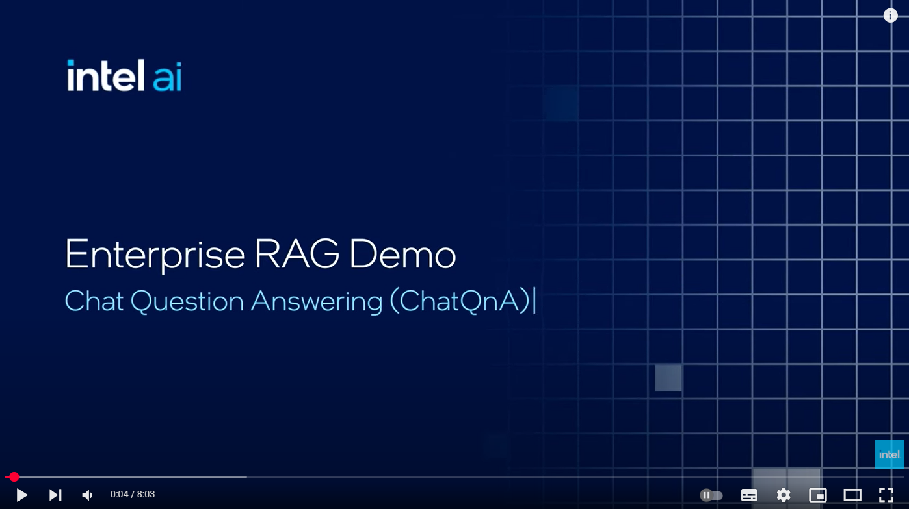
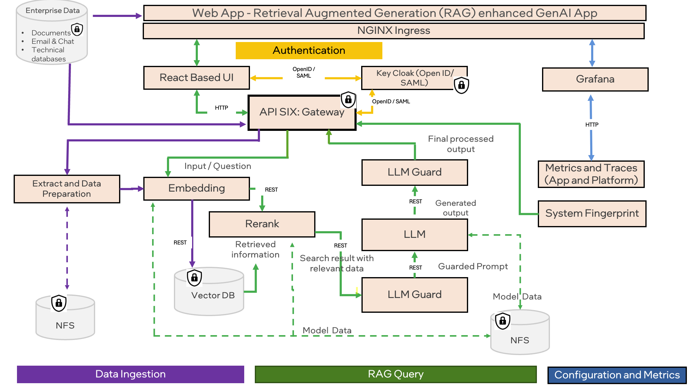

# Intel® AI for Enterprise RAG

<div align="center">
    <a href="https://www.youtube.com/watch?v=wWcUNle1kkg">
      
    </a>
</div>
&nbsp;

Intel® AI for Enterprise RAG makes turning your enterprise data into actionable insights easy. Powered by Intel® Gaudi® AI accelerators and Intel® Xeon® processors, Intel® AI for Enterprise RAG integrates components from industry partners to offer a streamlined approach to deploying solutions for enterprises. It scales seamlessly with proven orchestration frameworks, giving you the flexibility and choice your enterprise needs.

Intel® AI for Enterprise RAG builds upon the strong foundation of OPEA. It extends this base with key features that enhance scalability, security, and user experience. These include integrated Service Mesh capabilities, providing a seamless integration with modern service-based architectures. Additionally, production-ready validation ensures confidence in pipeline reliability, while a feature-rich UI for RAG as a service empowers users to easily manage and monitor their workflows. Furthermore, Intel® and partner support provide access to a broad ecosystem of solutions, combined with Integrated IAM with UI and application, ensuring secure and compliant operations. Programmable guardrails also enable fine-grained control over pipeline behavior, allowing for customized security and compliance settings.

**ChatQnA**

The ChatQnA solution uses retrieval augmented generation (RAG) architecture, which is quickly becoming the industry standard for chatbot development. It combines the benefits of a knowledge base (via a vector store) and generative models to reduce hallucinations, maintain up-to-date information, and leverage domain-specific knowledge. 



For the complete microservices architecture, refer [here](./docs/microservices_architecture.png)
<div align="left">
        <a href="https://opea.dev/" target="_blank">
        
    </a>
</div>

# Table of Contents

- [Documentation](#documentation)
- [System Requirements](#system-requirements)
- [Installation](#Installation)
- [Support](#support)
- [License](#license)
- [Security](#security)
- [Trademark Information](#trademark-information)

# Documentation

* [Deployment Guide](deployment/README.md) explains how to install and configure Intel® AI for Enterprise RAG for your needs.

# System Requirements


|         |                                                                                                           |
|--------------------|--------------------------------------------------------------------------------------------------------------------|
| Operating System   | Ubuntu 22.04                                                               |
| Hardware Platforms | 4th Gen Intel® Xeon® Scalable processors<br>5th Gen Intel® Xeon® Scalable processors<br>3rd Gen Intel® Xeon® Scalable processors and Intel® Gaudi® 2 AI Accelerator<br>4th Gen Intel® Xeon® Scalable processors and Intel® Gaudi® 2 AI Accelerator |
| Kubernetes Version   | 1.29
| Gaudi Firmware Version   | 1.18.0

## Hardware Prerequisites
To get the right instances to run Intel® AI for Enterprise RAG, follow these steps:

- visit Intel® Tiber™ AI Cloud using this [link](https://console.cloud.intel.com/home).
- In the left pane select `Catalog > Hardware`.
- Select `Gaudi® 2 Deep Learning Server` or `Gaudi® 2 Deep Learning Server - Dell`.
- Select the Machine image - `ubuntu-22.04-gaudi2-v1.18.0-metal-cloudimg-amd64-v20240803` with `Architecture: X86_64 (Baremetal only)`.
- Upload your public key and launch the instance
- Navigate to the `Instances` page and verify that the machine has reached its ready state, then click on "How to Connect via SSH" to configure your machine correctly for further installation.

## Requirements for Building from Source

### Software Prerequisites

Refer to the [prerequisites](./docs/prerequisites.md) guide for detailed instructions to install the components mentioned below:

-   **Kubernetes Cluster**: Access to a Kubernetes v1.29 cluster
-   **CSI Driver**: The K8s cluster must have the CSI driver installed, using the  [local-path-provisioner](https://github.com/rancher/local-path-provisioner)  with  `local_path_provisioner_claim_root`  set to  `/mnt`. For an example of how to set up Kubernetes via Kubespray, refer to the prerequisites guide:  [CSI Driver](./docs/prerequisites.md#csi-driver).
-   **Operating System**: Ubuntu 22.04
-   **Gaudi Software Stack**: Verify that your setup uses a valid software stack for Gaudi accelerators, see  [Gaudi support matrix](https://docs.habana.ai/en/latest/Support_Matrix/Support_Matrix.html). Note that running LLM on a CPU is possible but will significantly reduce performance.
-   **Prepared Gaudi Node**: Please refer to the [Gaudi Software Stack](./docs/prerequisites.md#gaudi-software-stack) section of the prerequisites section.
-   **Hugging Face Model Access**: Ensure you have the necessary access to download and use the chosen Hugging Face model. This default model used is `Mixtral-8x7B` for which access needs to be requested. Visit  [Mixtral-8x7B](https://huggingface.co/mistralai/Mixtral-8x7B-Instruct-v0.1) to apply for access.
- **Disk Space**: `1TB` of disk space is generally recommended. It is highly dependent on the model size. The model used in the default examples(`Mixtral-8x7B`) takes up a disk space of `~260GB`

# Installation

```
git clone https://github.com/intel/Enterprise-RAG.git
cd Enterprise-RAG/deployment
./one_click_chatqna.sh -g HUGGINGFACEHUB_API_TOKEN -z GRAFANA_PASSWORD -k KEYCLOAK_ADMIN_PASSWORD -i IP [-p HTTP_PROXY] [-u HTTPS_PROXY] [-n NO_PROXY] -d [PIPELINE] -t [TAG] -y [REGISTRY]
```

Proxy variables are optional.
Refer [Deployment](deployment/README.md#prerequisites) if you prefer to install with multiple options.

# Support

Submit questions, feature requests, and bug reports on the
GitHub Issues page.

# License

Intel® AI for Enterprise RAG is licensed under [Apache License Version 2.0](LICENSE). Refer to the
"[LICENSE](LICENSE)" file for the full license text and copyright notice.

This distribution includes third party software governed by separate license
terms. This third party software, even if included with the distribution of
the Intel software, may be governed by separate license terms, including
without limitation, third party license terms, other Intel software license
terms, and open source software license terms. These separate license terms
govern your use of the third party programs as set forth in the
"[THIRD-PARTY-PROGRAMS](THIRD-PARTY-PROGRAMS)" file.

# Security

[Security Policy](SECURITY.md) outlines our guidelines and procedures
for ensuring the highest level of Security and trust for our users
who consume Intel(R) AI for Enterprise RAG.

# Trademark Information

Intel, the Intel logo, Arc, Intel Atom, Intel Core, Iris,
OpenVINO, the OpenVINO logo, Pentium, VTune, and Xeon are trademarks
of Intel Corporation or its subsidiaries.

Arm and Neoverse are trademarks, or registered trademarks of Arm Ltd.

\* Other names and brands may be claimed as the property of others.

Microsoft, Windows, and the Windows logo are trademarks, or registered
trademarks of Microsoft Corporation in the United States and/or other
countries.

OpenCL and the OpenCL logo are trademarks of Apple Inc. used by permission
by Khronos.

(C) Intel Corporation
