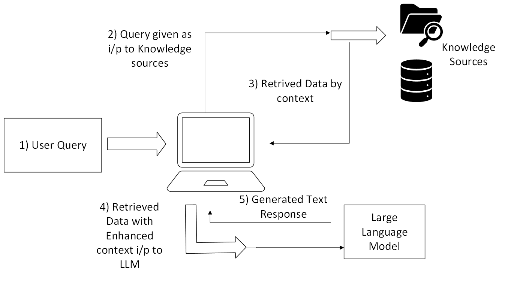

# 🚀 Enterprise RAG Applications with Intel Hardware

## 📋 Agenda
 
1. **Introduction**
 
2. **What is an Enterprise RAG Application?**
 
3. **Important Enterprise RAG Features**
 
4. **Additional Features**
 
5. **Relevance of Hardware**
    - Importance of optimized hardware for speed, scalability, and efficiency.
    - Intel's suite of products enhances RAG performance:
      - Intel® Xeon® Scalable Processors
      - Intel® Gaudi® AI Accelerators
      - Intel® Optane™ Persistent Memory
 
6. **Conclusion**

In today’s digital era, enterprises face the challenge of efficiently retrieving and utilizing relevant information. As demand for intelligent knowledge management grows, companies compete to develop advanced solutions that optimize data search, management, and utilization.

One such innovation is Enterprise Retrieval-Augmented Generation (RAG) Applications—AI-powered solutions that combine retrieval-based search with generative AI models to enhance knowledge retrieval and decision-making.

## 🤖 So, What is an Enterprise RAG Application?

Enterprise RAG applications leverage retrieval-augmented generation (RAG) technology to enrich large language models (LLMs) with enterprise-specific knowledge. Unlike traditional AI models that rely solely on pre-trained data, RAG applications actively fetch relevant documents from internal databases, vector stores, or external sources to generate contextually accurate and up-to-date responses. This dynamic approach significantly improves information precision and minimizes AI hallucinations.

## 🔑 Important Enterprise RAG Features

### 1. 🕵️‍♂️ Intelligent Real-Time Data Retrieval

At the core of an Enterprise RAG system is its ability to intelligently retrieve and process data from diverse sources, ensuring accurate and context-aware responses. It integrates with internal repositories like SharePoint and Confluence, technical documents and email archives, public knowledge bases and APIs, and vector databases for semantic search. Unlike static AI models, RAG systems fetch real-time, enterprise-specific information, reducing misinformation and improving decision-making. This enhances efficiency, accuracy, and productivity, allowing teams to access critical insights instantly without sifting through fragmented systems.

### 2. 🎯 Contextual Re-ranking of Retrieved Data for Precision

The information/vectors drawn out on query are ranked to rank the most contextually correct, credible, and relevant information first, providing users with answers that they really need. Rather than overwhelming users with a sheer tidal wave of loosely connected information, RAG applications bring to the surface the most valuable information first, presenting responses as concise, well-formatted, and ready-to-go.

### 3. 🗣️ Leverage of Advanced Natural Language Processing Enabling Intuitive Conversations

Enterprise RAG applications utilize advanced LLMs in combination with specialized embedding models to provide intelligent, context-aware interactions. They can understand deep searches with human-style comprehension, dialoguing naturally with users, and generating answers applicable to the customized vocabulary and surrounding context of the business.
Apart from the features mentioned above a few more are important to
further enhance and secure the concept application of RAG applications:
### 📋 Additional Features

- **🔒 Secure Authentication and Role-Based Access to safeguard
    enterprise data**: Security being of paramount importance for enterprise applications, RAG systems must ensure strict access control and encryption mechanisms to protect sensitive information.
- **🛡️ LLM Guardrails for Compliance and Safety**: This is needed to fact-check AI outputs to prevent hallucinations or false information, redaction of sensitive data if needed before generating response and mitigating biases.
- **📈 Having a Scalable Infrastructure**: RAG applications should be designed for growth and scalability. Often using cloud-native architectures, these systems should leverage microservice architecture, secure API communications, and suitable container orchestration technologies for security and scalability.
- **📊 Real-Time Monitoring and Performance Metrics for Continuous Optimization**: RAG applications leverage tools like Grafana, Prometheus, and OpenTelemetry to track system performance, response times, and data retrieval efficiency. This real-time monitoring enables enterprises to optimize AI workflows, enhance responsiveness, and continuously improve the user experience.

## ⚙️ Relevance of Hardware

While AI models drive RAG applications, hardware infrastructure is just as vital for speed, scalability, and efficiency. Fast data retrieval, real-time AI processing, and vector search optimization rely on GPUs, AI Accelerators, high-speed storage, and specialized computing resources to ensure low latency and high accuracy. Without optimized hardware, even the most advanced AI models can suffer from slow performance and limited scalability. The right hardware unlocks the full potential of RAG, enabling fast, intelligent, and enterprise-ready AI solutions at scale.

Intel's suite of products—including Xeon® Scalable Processors, Gaudi® AI Accelerators, and Optane™ Persistent Memory—significantly enhance the performance and scalability of Retrieval-Augmented Generation (RAG) applications in enterprise environments.

- **💻 Intel® Xeon® Scalable Processors**: These processors are engineered to handle compute-intensive workloads efficiently, featuring increased core counts, double the memory bandwidth, and integrated AI acceleration capabilities. This design ensures that RAG applications can process complex queries swiftly and manage large-scale data retrieval operations effectively.
- **⚡ Intel® Gaudi® AI Accelerators**: Tailored for deep learning tasks, Gaudi accelerators optimize both training and inference processes within RAG systems. They offer cost-effective scaling and are designed to integrate seamlessly with existing Ethernet infrastructures, eliminating the need for proprietary networking solutions. This integration facilitates efficient handling of large-scale AI workloads, enhancing the responsiveness and accuracy of RAG applications.
- **💾 Intel® Optane™ Persistent Memory (PMem)**: By providing high-capacity, persistent storage, Optane memory reduces input/output bottlenecks, enabling faster access to vector databases and knowledge repositories. This acceleration is crucial for RAG applications that require rapid data retrieval to generate timely and relevant responses.

Enterprise Retrieval-Augmented Generation (RAG) applications enhance decision-making by providing real-time, relevant knowledge, improving productivity, and reducing time spent searching for information. They ensure strong security with access controls and encryption, while scalable architectures support growing data needs. By grounding AI responses in verifiable enterprise data, RAG minimizes hallucination risks and seamlessly integrates with existing IT infrastructure for long-term efficiency.

To maximize performance, Intel® Xeon® Scalable Processors power AI workloads with built-in acceleration, while Intel® Gaudi® AI Accelerators optimize deep learning inference and training. Intel® Optane™ Persistent Memory enables fast data retrieval, reducing latency. Leveraging Intel’s AI-optimized hardware ensures RAG applications remain scalable, secure, and high-performing across enterprise environments.
