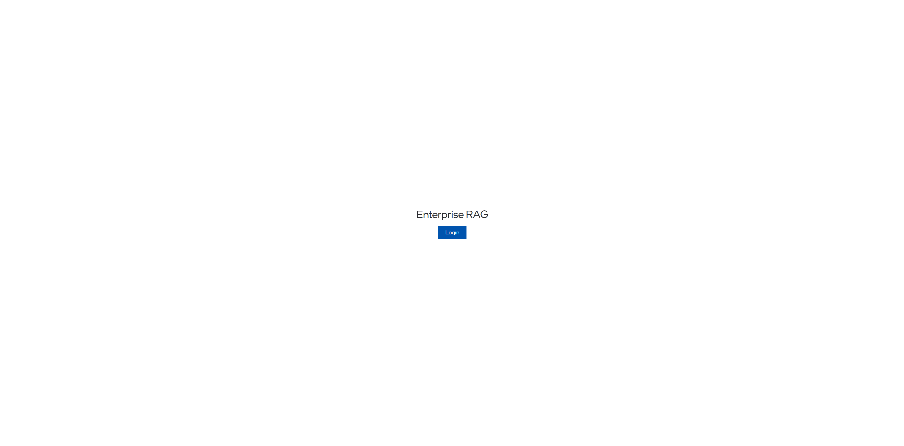
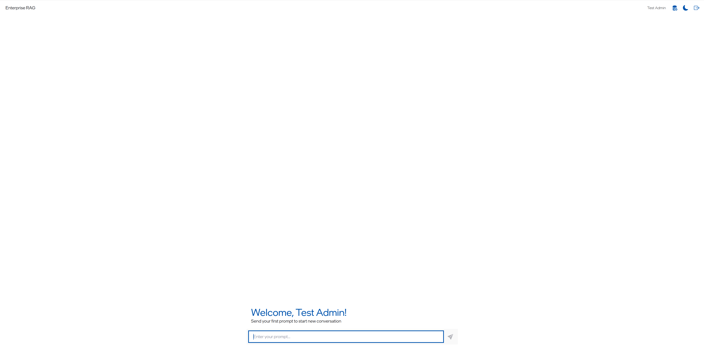
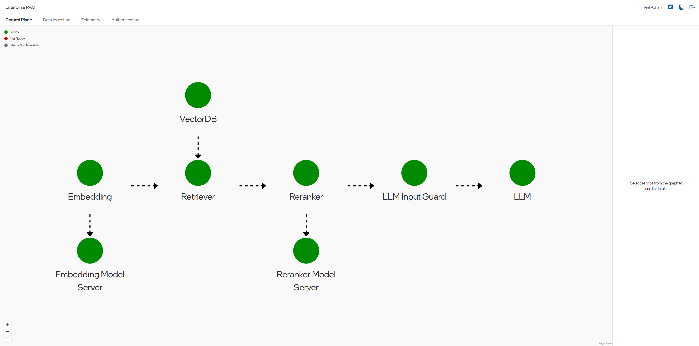
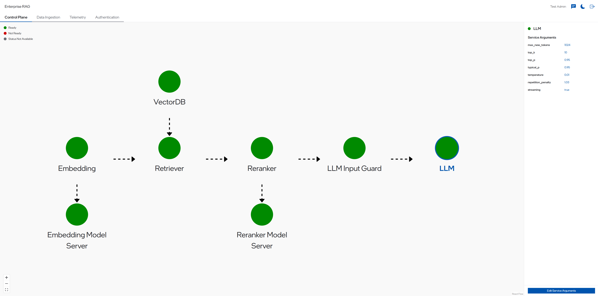
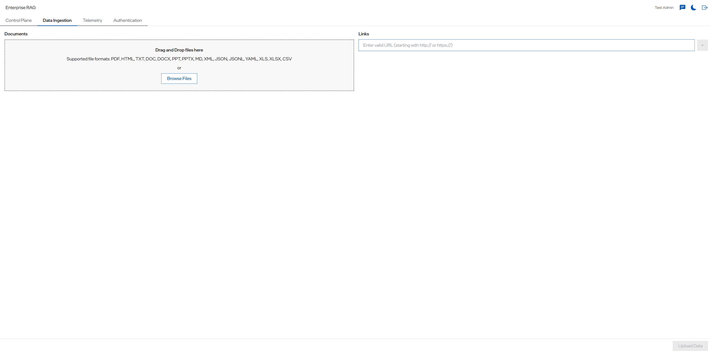

# Enterprise RAG UI

## Validating UI Access

To access the Enterprise RAG UI, please follow the instructions outlined in the [Getting Started](./getting_started.md) guide under the `Accessing the UI` section.

Upon visiting https://erag.com, you should observe the following UI layout:

**_NOTE!_**
To access the UI application, you will need to obtain login credentials from the Enterprise RAG team. Please reach out to them for assistance.

Once logged in, navigate to the homepage of the Enterprise RAG UI Application. In the text input field, enter a question, such as "What is AVX512?" and click on the `Submit` button. Verify that the chat responds correctly to your question.

In the top right section, you have three options - `Admin Panel`, `Dark Mode` and `Logout`.

### Admin Panel

The admin panel has options to view `Control Plane`, `Data Ingestion`, `Telemetry` and `Authentication`.

The `Control Plane` shown above allows the user to see all the components of the currently deployed pipeline as a graph. Each service can be selected from the graph to get further information on the configuration settings of each service. In some components it is also possible to edit service arguments for the services.

For example, when you click on the LLM service, as shown in the screenshot below, the right pane is populated with the LLM parameters that can be modified like `max_new_tokens`, `temperature` etc. After changing the parameters, you can click on `confirm changes`.

### Data Ingestion

The admin panel also has the interface for data ingestion as shown below:

Any file belonging to the supported file format shown in the screenshot or a link to a website can be added to the knowledge base via this interface.