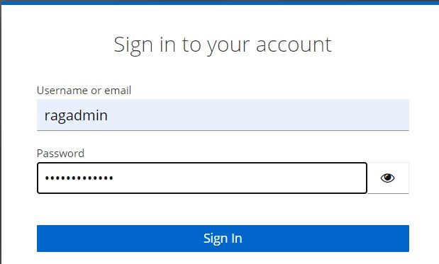
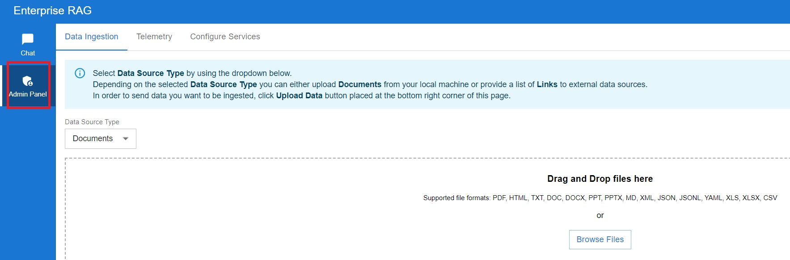
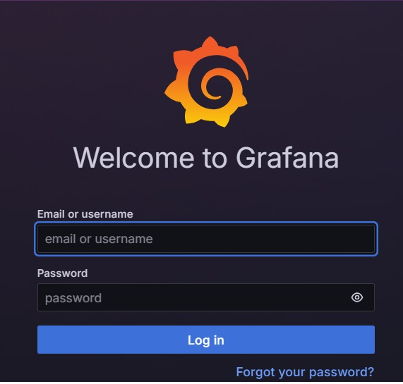

## Validate application

To validate application first make sure you can access UI from your machine [access UI from your machine](https://github.com/intel-innersource/applications.ai.enterprise-rag.enterprise-ai-solution/blob/documentation_vaidate_application/deployment/microservices-connector/README.md#access-ui-from-your-local-machine)

Login to application as `ragadmin`

**_NOTE!_**
Please ask Enterprise RAG team for credentials to access UI application.

In the text box type question, for example "What is AVX512?" and click on `SUBMIT` button. Verify that the chat is replying to the question.

Click on Admin Panel , try to drag simple document to the dropbox. Next click `upload data` button to check if application is uploading data.

Next Click on `Telemetry` and enter Grafana dashboard. Verify you can access monitoring application.

**_NOTE!_**
Please ask Enterprise RAG team for credentials to access Grafana.

