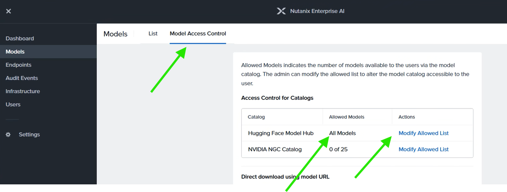

# Nutanix Enterprise AI on AWS EKS 🚀

[](https://opensource.org/licenses/Apache-2.0)
[](https://www.terraform.io/)
[](https://aws.amazon.com/eks/)
[](https://portal.nutanix.com/)

This repository provides a complete Infrastructure as Code (IaC) solution for deploying **Nutanix Enterprise AI** on Amazon Web Services (AWS) using Amazon Elastic Kubernetes Service (EKS).

## 📖 Table of Contents

1. [Installation & Setup](#installation--setup)
2. [Post EKS NAI Deployment Configuration](#post-eks-nai-deployment-configuration)
3. [Nutanix Enterprise AI Installation](#nutanix-enterprise-ai-installation)
4. [Dashboard Access](#dashboard-access)
5. [Creating Inference Endpoints](#creating-inference-endpoints)
6. [(OPTIONAL) Additional Monitoring & Troubleshooting](#optional-additional-monitoring--troubleshooting)

## Overview

This solution deploys:

- **[Nutanix Enterprise AI Standalone](https://portal.nutanix.com/page/documents/details?targetId=Nutanix-Enterprise-AI-v2_4:top-nai-cluster-setup-eks-t.html)** on AWS EKS
- Complete AWS infrastructure including VPC, subnets, and EKS cluster
- Required Kubernetes components and storage classes
- Full end-to-end AI inference capabilities

### Key Features

- ✅ **Enterprise-grade AI platform** with Nutanix Enterprise AI Pro (45-day trial)
- ✅ **Scalable Kubernetes deployment** on AWS EKS
- ✅ **Intel AMX optimization** support for enhanced performance
- ✅ **Complete automation** with Terraform infrastructure provisioning
- ✅ **Production-ready** monitoring and observability stack

---

## Installation & Setup

### Clone the Repository

```bash
git clone https://github.com/opea-project/Enterprise-RAG.git
cd Enterprise-RAG/deployment/terraform/aws/nutanix/eks-nutanix-ai
```

### Configure Deployment Settings

Modify the `locals` block in `Enterprise-RAG/deployment/terraform/aws/nutanix/eks-nutanix-ai/main.tf`:

```hcl
locals {
  name   = "your-cluster-name"    # Update with your desired name
  region = "us-east-1"           # Update with your preferred region
  tags = {
    Owner    = "your@email.com"
    Project  = "Nutanix AI"
    Duration = "0"              
  }
}
```

### Deploy EKS Infrastructure with Terraform

Run the following Terraform commands:

```bash
   aws configure          # Configure AWS CLI with your credentials
   terraform init
   terraform plan
   terraform apply
```

---

## Post EKS NAI Deployment Configuration

### Configure kubectl for EKS Cluster

```bash
# Verify AWS identity
aws sts get-caller-identity

# Configure kubectl for your EKS cluster
aws eks update-kubeconfig --region us-east-1 --name $(terraform output -raw cluster_name)
# Example: aws eks update-kubeconfig --region us-east-1 --name nutanix-ai-4241

# Test the connection
kubectl get svc

# Verify nodes
kubectl get nodes
```

#### Deploy EFS Kubernetes Resources

**Additional EFS Resources:**

- The steps below configure EFS for Nutanix AI but if required, for additional details see [NUTANIX-AI-EFS-README.md](NUTANIX-AI-EFS-README.md)
- If needed, also read EFS file system [AWS instructions](https://docs.aws.amazon.com/efs/latest/ug/creating-using-create-fs.html)

```bash
# Use the provided script to deploy EFS-enabled resources
chmod +x ./deploy-efs-k8s.sh
sed -i 's/\r$//' ./deploy-efs-k8s.sh
./deploy-efs-k8s.sh
```

Or manually:

```bash
# Get the EFS values from Terraform
EFS_FILE_SYSTEM_ID=$(terraform output -raw efs_file_system_id)
EFS_ACCESS_POINT_ID=$(terraform output -raw efs_access_point_id)

# Edit efs-example.yaml with actual values and apply
kubectl apply -f efs-example.yaml
```

#### Verify EFS CSI Driver

```bash
# Verify EFS CSI driver is running
kubectl get pods -n kube-system | grep efs-csi

# Check CSI drivers
kubectl get csidrivers
```

#### Validate Storage Configuration

```bash
# Check storage class
kubectl get storageclass efs-sc

# Check persistent volume
kubectl get pv efs-pv

# Check persistent volume claim
kubectl get pvc efs-claim

```

### Install Kubernetes Components

#### Node Feature Discovery

Node Feature Discovery detects hardware features and system configuration, enabling Intel AMX for AI inference optimization.

```bash
# Install Node Feature Discovery
kubectl apply -k "https://github.com/kubernetes-sigs/node-feature-discovery/deployment/overlays/default?ref=v0.17.3"

# Validate NFD is running
kubectl -n node-feature-discovery get all

# Check for Intel AMX Labels (for supported hardware)
kubectl describe nodes | grep AMXTILE
# Expected output: feature.node.kubernetes.io/cpu-cpuid.AMXTILE=true
```

#### Envoy Gateway

```bash
helm upgrade --install eg oci://docker.io/envoyproxy/gateway-helm \
  --version v1.3.2 \
  -n envoy-gateway-system \
  --create-namespace
```

#### Cert-Manager

```bash
helm repo add cert-manager https://charts.jetstack.io
helm upgrade --install my-cert-manager cert-manager/cert-manager \
  --version 1.16.4 \
  -n cert-manager \
  --create-namespace \
  --set installCRDs=true \
  --wait
```

#### KServe

```bash
# Install KServe CRDs
helm upgrade --install kserve-crd oci://ghcr.io/kserve/charts/kserve-crd \
  --version v0.15.2 \
  -n kserve \
  --create-namespace \
  --wait

# Install KServe
helm upgrade --install kserve oci://ghcr.io/kserve/charts/kserve \
  -n kserve \
  --version v0.15.2 \
  --create-namespace \
  --set kserve.controller.deploymentMode=RawDeployment \
  --set kserve.controller.gateway.disableIngressCreation=true
```

#### Prometheus Stack

```bash
helm repo add prometheus-community https://prometheus-community.github.io/helm-charts
helm repo update
helm install kube-prometheus-stack prometheus-community/kube-prometheus-stack \
  --namespace monitoring \
  --create-namespace
```

---

## Nutanix Enterprise AI Installation

### System Requirements

- **EKS cluster** with Kubernetes version compatible with NAI v2.4
- **AWS CLI, kubectl, and Helm** installed and configured
- **Nutanix AI Portal Account** for Nutanix AI Docker Tokens

### Acquire Nutanix Enterprise AI Docker Access Token

[See instructions here on how to acquire the Nutanix AI Docker Access Token](https://portal.nutanix.com/page/documents/details?targetId=Portal-Help:sup-generating-docker-hub-access-tokens-sp-t.html)

### Prepare Nutanix Helm Repository

Add and update the Nutanix helm repository, then pull the NAI-core chart:

```bash
# Add Nutanix helm repository
helm repo add ntnx-charts https://nutanix.github.io/helm-releases && helm repo update ntnx-charts

# Search for available versions
helm search repo ntnx-charts/nai-core --versions

# Pull and extract the chart
helm pull ntnx-charts/nai-core --version=2.4.0 --untar=true
```

### Install Nutanix Enterprise AI Core

Install or upgrade the `nai-core` helm chart in the `nai-system` namespace:

> **⚠️ Important**: Replace `***DOCKER_USERNAME***` and `***DOCKER_API_KEY***` with your Nutanix AI Docker Hub Access Token. [Instructions here.](https://portal.nutanix.com/page/documents/details?targetId=Portal-Help:sup-generating-docker-hub-access-tokens-sp-t.html)

```bash
helm upgrade --install nai-core ntnx-charts/nai-core \
  --version=2.4.0 \
  -n nai-system \
  --create-namespace \
  --wait \
  --set imagePullSecret.credentials.username=***DOCKER_USERNAME*** \
  --set imagePullSecret.credentials.email=***DOCKER_USERNAME*** \
  --set imagePullSecret.credentials.password=***DOCKER_API_KEY*** \
  --insecure-skip-tls-verify \
  --set naiApi.storageClassName=efs-sc \
  --set defaultStorageClassName=gp2 \
  -f ./nai-core/aws-values.yaml
```

### Validate Installation

```bash
# Check pod status in nai-system namespace
kubectl get pods -n nai-system  
# All pods should be in Running/Ready state
```

---

## Dashboard Access

### Configure TLS and Gateway

Refer to the [Nutanix Enterprise AI Dashboard Documentation](https://portal.nutanix.com/page/documents/details?targetId=Nutanix-Enterprise-AI-v2_0:top-nai-login-t.html) for complete setup instructions.

### Setup HTTPS Access

1. **Get the Envoy service details**

   ```bash
   kubectl get svc -n envoy-gateway-system
   ```

2. **Edit the Envoy service to enable HTTPS**

   ```bash
   kubectl edit service envoy-nai-system-nai-ingress-gateway-ff52ba1f --namespace envoy-gateway-system
   ```

   Add the HTTPS port configuration:

   ```yaml
   - name: https         
     port: 443
     protocol: TCP
     targetPort: 8443
   ```

   Or run the command below to add the HTTPS port configuration:

   ```bash
   kubectl apply --server-side -f envoy-service-https.yaml
   ```

3. **Create TLS certificates**

   ```bash
   openssl req -x509 -nodes -newkey rsa:2048 -keyout tls.key -out tls.crt -days 365 \
     -subj "/C=US/ST=Texas/L=FortWorth/O=MyOrg/OU=MyUnit/CN=example.com"
   ```

4. **Create Kubernetes TLS secret**

   ```bash
   kubectl create secret tls ingress-certificate \
     --namespace nai-system \
     --cert=tls.crt \
     --key=tls.key
   ```

5. **Configure the NAI gateway for TLS**

   ```bash
   kubectl edit gateway nai-ingress-gateway --namespace nai-system
   ```

   Modify to match your certificate name under `spec->listeners`:

   ```yaml
   tls:
     certificateRefs:
     - name: nai-letsencrypt-certificate <------- Modify to match secret name
   ```

6. **Validate gateway configuration**

   ```bash
   kubectl describe gateway nai-ingress-gateway --namespace nai-system
   ```

### Get Access URL

Retrieve the Nutanix Enterprise AI portal URL:

```bash
kubectl get svc -n envoy-gateway-system

# Example output
NAME                                            TYPE           CLUSTER-IP      EXTERNAL-IP                                                              PORT(S)                                   AGE
envoy-gateway                                   ClusterIP      172.20.18.224   <none>                                                                   18000/TCP,18001/TCP,18002/TCP,19001/TCP   7d22h
envoy-nai-system-nai-ingress-gateway-ff52ba1f   LoadBalancer   172.20.28.43    nutanix-example-url.us-east-1.elb.amazonaws.com   80:30214/TCP,443:31000/TCP                17m

# Login URL
https://nutanix-example-url.us-east-1.elb.amazonaws.com
```

### Login Credentials

Default credentials for Nutanix Enterprise AI portal:

- **Username**: `admin`
- **Password**: `Nutanix.123`

> **🔒 Security Note**: You will be asked to change the default password upon first login

---

## Creating Inference Endpoints

### Prerequisites and Setup

**Obtain Hugging Face Token:**

1. Sign up at [Hugging Face](https://huggingface.co/) and create an API token
2. Navigate to **Settings** in the Nutanix Enterprise AI portal (click your username in the top-right corner)
3. Add your Hugging Face token

**Configure Model Access:**

1. Go to **Settings** in the Nutanix Enterprise AI portal
2. Click **Allow All** for model access control



**Useful kubectl Commands:**

```bash
# Get Kserve information
kubectl get isvc -n nai-admin

# Describe Kserve information
kubectl describe isvc SERVICE_NAME -n nai-admin

# Get all PODs in all namespaces
kubectl get pods --all-namespaces

# Get all services in all namespaces
kubectl get svc --all-namespaces
```

### Endpoint Creation Steps

#### 1. Access Endpoint Creation Interface

Navigate to **Endpoints** → **Create Endpoint** in the Nutanix Enterprise AI portal.

#### 2. Configure Basic Settings

| Setting | Description |
|---------|-------------|
| **Endpoint Name** | Lowercase letters, numbers, or hyphens (must start with letter) |
| **Description** | Optional endpoint description |
| **Model Type & Instance** | Select your imported active model |
| **Acceleration Type** | Choose CPU |
| **Create a New API Key** | For access |

#### 3. Configure Advanced Settings

| Parameter | Options | Notes |
|-----------|---------|-------|
| **Inference Engine** | Available engines for selected model | |
| **Instance Count** | Number of inference instances | |
| **Resource Settings** | vCPUs, memory, engine type | Optional custom configuration |
| **Context Length** | Max tokens (input + output) | Depends on model and resources |

#### 4. Review and Deploy

1. **Review Summary**: Verify all configuration settings
2. **Click Create**: Deploy the endpoint
3. **Monitor Status**: Check endpoint status on the Endpoints page

### Understanding Endpoint Status

| Status | Description | Action Required |
|--------|-------------|-----------------|
| **Active** ✅ | Ready for inference requests | None - start using! |
| **Pending** ⏳ | Waiting for resources | Monitor and wait |
| **Processing** 🔄 | Being created/deployed | Monitor progress |
| **Failed** ❌ | Deployment error | Check logs and troubleshoot |

### Validation and Troubleshooting

```bash
# Check NAI system pods
kubectl get pods -n nai-admin -w

# Check endpoint status
kubectl get isvc -n nai-admin

# Troubleshoot failed endpoints
kubectl describe isvc ENDPOINT_NAME -n nai-admin
```

### Fix Prometheus Metrics

```bash
pip install kubernetes
python3 fix_metrics.py
```

---
## 🚀 Congratulations! 🎉

At this point, you have successfully deployed Nutanix Enterprise AI on AWS EKS and it's ready for use with Intel® AI for Enterprise RAG!

---


## (OPTIONAL) Monitoring & Troubleshooting

#### Common Kubernetes Commands

| Command Category | Command | Description |
|-----------------|---------|-------------|
| **Pod Management** | `kubectl get pods --all-namespaces` | List all pods across namespaces |
| | `kubectl describe pod POD_NAME -n NAMESPACE` | Get detailed pod information |
| | `kubectl logs POD_NAME -n NAMESPACE -f` | Follow pod logs in real-time |
| **Service Discovery** | `kubectl get svc --all-namespaces` | List all services |
| **Deployment Status** | `kubectl get deployments --all-namespaces` | List all deployments |
| **Node Information** | `kubectl get nodes -o wide` | Get node information |
| | `kubectl top nodes` | Show node resource usage |

### System Health Checks

```bash
# Check unhealthy pods
kubectl get pods --all-namespaces --field-selector=status.phase!=Running,status.phase!=Succeeded

# Restart unhealthy pods (they will be recreated by controllers)
kubectl delete pods --all-namespaces --field-selector=status.phase!=Running,status.phase!=Succeeded

# Validate NAI system pods
kubectl get pods -n nai-system

# Check specific inference endpoint
kubectl describe pod ENDPOINT_POD_NAME -n nai-admin
```

### Node Debugging

```bash
# Debug node issues
kubectl debug node/NODE_NAME -it --image=ubuntu:22.04

# Access node shell for detailed analysis
kubectl exec -it DEBUG_POD_NAME -- /bin/bash
```

> **💡 Tip**: Always check pod events and logs when troubleshooting: `kubectl get events -n NAMESPACE`

### Intel AMX Monitoring

For Intel AMX-enabled workloads, monitor tile usage during inference operations using Processwatch.

#### Installation and Usage

1. Find where the endpoint is running

   ```bash
   # Check specific inference endpoint
   kubectl describe pod ENDPOINT_POD_NAME -n nai-admin
   ```

2. Access your EKS node via AWS Session Manager or SSH and install processwatch

   ```bash
   # Install prerequisites
   sudo yum install git -y
   sudo yum update
   sudo yum install bpftool zlib-devel zlib-static elfutils-libelf-devel clang cmake3 llvm glibc-static

   # Clone and build processwatch
   git clone --recursive https://github.com/intel/processwatch.git
   cd processwatch
   ./build.sh

   # Monitor Intel AMX tile usage during inference
   sudo processwatch -f AMX_TILE
   ```

### Terraform Destroy Issue

`terraform destroy` may sometimes fail with errors like this when AWS resources have active dependencies:

```
Error: deleting EC2 Subnet (subnet-01c6c5c08ea973bf6) ...
       DependencyViolation: The subnet 'subnet-01c6c5c08ea973bf6' has dependencies and cannot be deleted.

Error: deleting EC2 Internet Gateway (igw-01874ebb29c30139c) ...
       DependencyViolation: Network vpc-0650d0bcbe00812d2 has some mapped public address(es).
       Please unmap those public address(es) before detaching the gateway.
```

For example, subnets cannot be deleted if they are still associated with network interfaces, route tables, or load balancers. Similarly, internet gateways cannot be detached from a VPC if there are mapped public IP addresses. These dependency violations occur because AWS enforces resource relationships to prevent accidental disruption.

To resolve this issue, manually identify and remove any dependent resources before retrying `terraform destroy`. These dependencies most commonly include load balancers and non-default security groups. Ensure all associated resources are deleted or detached to prevent AWS dependency violations.

```bash
# Identify and remove load balancers
aws elb describe-load-balancers --query 'LoadBalancerDescriptions[*].LoadBalancerName'
[
    "load_balancer_name"
]
aws elb delete-load-balancer --load-balancer-name <load_balancer_name>

# Identify and remove non-default security groups
aws ec2 describe-security-groups --filters Name=vpc-id,Values=<vpc_id> \
    --query "SecurityGroups[?GroupName!='default'].GroupId"
[
    "security_group_id"
]
aws ec2 delete-security-group --group-id <security_group_id>
{
    "Return": true,
    "GroupId": "security_group_id"
}

# Re-run terraform destroy
terraform destroy
```

---

### Additional Resources

- [Nutanix Enterprise AI Documentation](https://portal.nutanix.com/page/documents/details?targetId=Nutanix-Enterprise-AI-v2_4:top-nai-cluster-setup-eks-t.html)
- [AWS EKS User Guide](https://docs.aws.amazon.com/eks/latest/userguide/)
- [Ubuntu EKS Images](https://cloud-images.ubuntu.com/docs/aws/eks/)
- [Intel AMX Documentation](https://www.intel.com/content/www/us/en/developer/articles/guide/deep-learning-with-intel-advanced-matrix-extensions-amx.html)

---

## Summary

This solution provides a complete end-to-end deployment of Nutanix Enterprise AI on AWS EKS with:

✅ **Automated Infrastructure**: Terraform-managed AWS resources  
✅ **Production Ready**: Monitoring, observability, and security configurations  
✅ **Intel Optimized**: AMX acceleration support for enhanced performance  
✅ **Scalable Architecture**: Kubernetes-native deployment with auto-scaling capabilities  

**Important**: Remember to **clean up resources** with `terraform destroy` when no longer needed to avoid unnecessary AWS charges.

For questions or support, refer to the [Nutanix Enterprise AI documentation](https://portal.nutanix.com/page/documents/details?targetId=Nutanix-Enterprise-AI-v2_4:top-nai-cluster-setup-eks-t.html).
