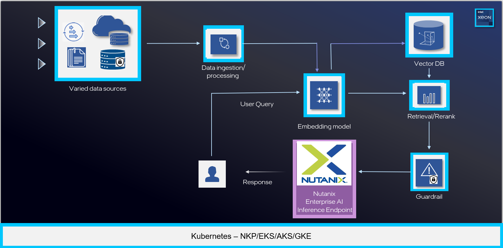

# Enterprise RAG Chatbot - Deployment Guide
<p align="center">
    
</p>

<!-- omit in toc -->
## Table of Contents

- [Enterprise RAG Chatbot - Deployment Guide](#enterprise-rag-chatbot---deployment-guide)
  - [Requirements for Nutanix Enterprise AI + Intel® AI for Enterprise RAG Deployment](#requirements-for-nutanix-enterprise-ai--intel-ai-for-enterprise-rag-deployment)
      - [On-prem Deployments](#on-prem-deployments)
      - [Cloud Deployment](#cloud-deployment)
  - [Nutanix Enterprise AI Endpoint Configuration](#nutanix-enterprise-ai-endpoint-configuration)
  - [Tested SLAs](#tested-slas)
  - [Architecture Diagram](#architecture-diagram)
    - [Logical architecture diagram](#logical-architecture-diagram)
  - [Deployment Steps](#deployment-steps)
  - [1.Tools Installation](#1tools-installation)
    - [Install Terraform](#install-terraform)
    - [Install AWS CLI](#install-aws-cli)
    - [Install kubectl](#install-kubectl)
    - [Install Helm](#install-helm)
  - [2.Deploy Nutanix Enterprise AI](#2deploy-nutanix-enterprise-ai)
  - [3.Deploy Intel® AI for Enterprise RAG](#3deploy-intel-ai-for-enterprise-rag)
  - [4. (Optional) Update Existing Intel® AI for Enterprise RAG Deployment to Use Nutanix Enterprise AI endpoint](#4-optional-update-existing-intel-ai-for-enterprise-rag-deployment-to-use-nutanix-enterprise-ai-endpoint)
    - [Prerequisites](#prerequisites)
    - [Obtain Nutanix Enterprise AI Endpoint Details](#obtain-nutanix-enterprise-ai-endpoint-details)
    - [Update the ChatQA GMConnector Configuration](#update-the-chatqa-gmconnector-configuration)
    - [Update the vLLM API Key Secret](#update-the-vllm-api-key-secret)
    - [Verify the Configuration](#verify-the-configuration)

## Requirements for Nutanix Enterprise AI + Intel® AI for Enterprise RAG Deployment

Below are initial deployment guidance to help you get started. What follows are some tested SLAs based on the provided system requirements for on-prem or cloud deployments. Note that these are provided as a starting point. These configurations can easily be scaled in Nutanix Enterprise AI and Intel® AI for Enterprise RAG to support customer environment needs.

These requirements support both Nutanix Enterprise AI and Intel® AI for Enterprise RAG.

#### On-prem Deployments
| Resource Type | Specs |
| ------------- | ----- |
| Compute | 4x 32cores Intel Xeon 6 processors (generally 2x Dual Socket servers) |
| Memory | 256GB per server (512GB Total) |
| Storage | 512GB Total of disk space is generally recommended, though this is highly dependent on the model size and quantity |

#### Cloud Deployment
| Resource Type                      | Specs                            |
| ---------------------------------- | -------------------------------- |
| Number of Instances                | 4 VM Instances                   |
| AWS EC2 Instance Type              | 4x c8i.16xlarge                  |
| GCP Compute Engine Instance Type   | 4x c4-standard-48-lssd           |
| Azure VM Instance Type             | 4x Standard_D64s_v6              |
| Remote File Storage (NFS equivalent) | 512GB Total                    

> [!NOTE]
> For VMs, a Virtual core may actually represent a hyperthread. We suggest using VM instances with 64 vCPUs each(or 48 vCPUs if 64 does not exist). 

## Nutanix Enterprise AI Endpoint Configuration

We have tested the following Nutanix Enterprise AI NAI Endpoint configuration to support Intel® AI for Enterprise RAG workloads on Intel® Xeon processors.

| Resource Type                      | Specs        | Comments           |
| ---------------------------------- | ------------ | ------------------ |
| Nutanix Enterprise AI NAI Endpoint | 2x 32vCPUs   | Per Model Endpoint |

## Tested SLAs

Below are our initial tested SLAs based on the provided system requirements for on-prem or cloud deployments. Note that these are provided as a starting points. SLAs can vary based on model size, concurrency, and vector DB size requirements.

| Metric Measured | Value |
| --------------- | ----- |
| Time-to-First-Token (TTFT) | <3s  |
| Time Per Output Token (TPOT) | <150ms  |
| Concurrency | 32 concurrent users |
| SLM/LLM Model Size | <15B |
| VectorDB Vectors      | `100 Million`|

**Note: Users can introduce other model sizes, but that could impact compatibility and performance. Carefully evaluate your requirements and test thoroughly.**

> [!NOTE]
> In this case vCPUs means cores with HyperThreading enabled. In other VM environment than AWS, HyperThreading might be disabled.

## Architecture Diagram

### Logical architecture diagram
<p align="center">
    
</p>


## Deployment Steps

1. Tools Installation
2. Deploy/Configure Nutanix Enterprise AI on EKS or on-premises
3. Deploy/Configure Intel® AI for Enterprise RAG on EKS or on-premises
4. Validate Demo by navigating to the Intel® AI for Enterprise RAG Web Application


## 1.Tools Installation

### Install Terraform

Follow Terraform [instructions here](https://developer.hashicorp.com/terraform/tutorials/aws-get-started/install-cli#install-terraform)

Ubuntu Installation Example:
```bash
sudo apt-get update && sudo apt-get install -y gnupg software-properties-common
wget -O- https://apt.releases.hashicorp.com/gpg | \
gpg --dearmor | \

sudo tee /usr/share/keyrings/hashicorp-archive-keyring.gpg > /dev/null

echo "deb [arch=$(dpkg --print-architecture) signed-by=/usr/share/keyrings/hashicorp-archive-keyring.gpg] https://apt.releases.hashicorp.com $(grep -oP '(?<=UBUNTU_CODENAME=).*' /etc/os-release || lsb_release -cs) main" | sudo tee /etc/apt/sources.list.d/hashicorp.list

sudo apt update

sudo apt-get install terraform
```

### Install AWS CLI

Fresh Installation:

```bash
curl "https://awscli.amazonaws.com/awscli-exe-linux-x86_64.zip" -o "awscliv2.zip"
unzip awscliv2.zip
sudo ./aws/install
```

Update Existing Installation

```bash
curl "https://awscli.amazonaws.com/awscliv2.zip" -o "awscliv2.zip"
unzip awscliv2.zip
sudo ./aws/install --bin-dir /usr/local/bin --install-dir /usr/local/aws-cli --update
```

### Install kubectl

```bash
curl -LO "https://dl.k8s.io/release/$(curl -L -s https://dl.k8s.io/release/stable.txt)/bin/linux/amd64/kubectl"
sudo install -o root -g root -m 0755 kubectl /usr/local/bin/kubectl
kubectl version --client
```

### Install Helm

```bash
curl -fsSL -o get_helm.sh https://raw.githubusercontent.com/helm/helm/main/scripts/get-helm-3
chmod 700 get_helm.sh
./get_helm.sh
```
---
## 2.Deploy Nutanix Enterprise AI

1. For Nutanix Kubernetes Platform (NKP) or on-premises deployments, follow [Nutanix documentation](https://portal.nutanix.com/page/documents/details?targetId=Nutanix-Enterprise-AI-v2_4:top-nai-install-t.html)

2. For AWS EKS follow [EKS Deployment](NUTANIX-AI-EKS.md)

---
## 3.Deploy Intel® AI for Enterprise RAG

1. For Nutanix Kubernetes Platform (NKP) or on-premises deployments, follow [Intel® AI for Enterprise RAG deployment on Kubernetes](../application_deployment_guide.md). 
> [!NOTE] 
> If application will be deployed on Nutanix Kubernetes Platform (NKP), it is recommended to disable telemetry. The instructions are provided in the link.

2. For AWS EKS follow [EKS Deployment](../eks_deployment.md)

---
## 4. (Optional) Update Existing Intel® AI for Enterprise RAG Deployment to Use Nutanix Enterprise AI endpoint 

If you have an existing Intel® AI for Enterprise RAG deployment and want to switch the vLLM endpoint to point to a Nutanix Enterprise AI endpoint, follow the steps below. For more details on external LLM endpoint configuration, refer to the [Pipeline Configuration section in the EKS Deployment Guide](../eks_deployment.md#pipeline-configuration-optional).

### Prerequisites

- An existing Intel® AI for Enterprise RAG deployment with the `chatqa` pipeline running
- Access to a Nutanix Enterprise AI endpoint (URL, model name, and API key)
- `kubectl` configured to access your Kubernetes cluster

### Obtain Nutanix Enterprise AI Endpoint Details

1. Navigate to your Nutanix Enterprise AI management console
2. Click on **Endpoints** to view the list of available LLM endpoints
3. Select the desired vLLM endpoint to view its details, including:
   - Endpoint URL (e.g., `https://nutanix-ai-endpoint.example.com/api/v1/chat/completions`)
   - Model name (e.g., `llama-3-3b`)
   - API key

### Update the ChatQA GMConnector Configuration

Patch the `chatqa` GMConnector to use the new Nutanix Enterprise AI endpoint:

```bash
kubectl edit gmconnectors -n chatqa chatqa
```

Update the following variables. 

Example:

```yaml
env:
  LLM_MODEL_SERVER: vllm
  LLM_MODEL_SERVER_ENDPOINT: "https://nutanix-ai-endpoint.example.com/api/v1/chat/completions"
  LLM_MODEL_NAME: "llama-3-3b"
  LLM_TLS_SKIP_VERIFY: "false"  
```

Save and exit the editor to apply the changes.

### Update the vLLM API Key Secret

Update the secret containing the vLLM API key with your new Nutanix Enterprise AI API key:

```bash
kubectl patch secret vllm-api-key-secret \
  -n chatqa \
  --type merge \
  -p '{"stringData":{"LLM_VLLM_API_KEY":"YOUR_NUTANIX_AI_API_KEY_HERE"}}'
```

Replace `YOUR_NUTANIX_AI_API_KEY_HERE` with the actual API key from your Nutanix Enterprise AI endpoint.

### Verify the Configuration

1. Restart the LLM pods to pick up the new configuration:

```bash
kubectl rollout restart deployment llm-svc-deployment -n chatqa
```

2. Check the pod logs to verify the connection to the new endpoint:

```bash
kubectl logs -n chatqa deployment/llm-svc-deployment --tail=50
```
Look for log entries indicating successful connection to the Nutanix Enterprise AI endpoint.
```bash
[INFO] - [llms_microservice] - Connection with LLM model server validated successfully.
```

3. Test through the Chat UI to confirm.

---
