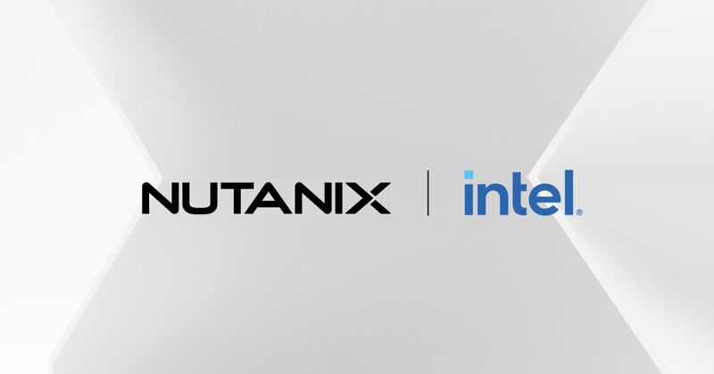

# Enterprise RAG Chatbot - Deployment Guide
<p align="center">
    
</p>

### Capacity Requirements for NAI + eRAG Deployment


| Resource Type | Guidance                                                                              |
| ------------- | ------------------------------------------------------------------------------------------------- |
| Nodes         | `4` K8 worker nodes                                                                  |
| Logical cores | `64` vCPUs per VM or per Socket                                                      |
| RAM memory    | `64GB` of RAM per VM or per Socket                                                   |
| Disk Space    | `256GB` of disk space is generally recommended, though this is highly dependent on the model size |

> [!NOTE]
> In this case vCPUs means cores with HyperThreading enabled. In other VM environment than AWS, HyperThreading might be disabled.

## Architecture Diagram

### Logical architecture diagram
<p align="center">
    
</p>

## AI Sizing Guide
| Resource Type         | Guidance                | Comments/Examples       |
| --------------------- | ----------------------- | ----------------------- |
| SLM/LLM Model Size    | Up to `13B` parameters  | Llama-3-7B, Llama-3-13B. Only guidance, bigger models |
| VectorDB Vectors      | `100 Million`             | Dependent on additional CPU/RAM capacity |
| Concurrent Users      |  `160 users`             | Dependent on additional CPU/RAM capacity |


## Steps

1. Tools Installation
2. Deploy/Configure Nutanix AI on EKS or on-premises
3. Deploy/Configure Intel® AI for Enterprise RAG on EKS or on-premises
4. Validate Demo by navigating to the Intel® AI for Enterprise RAG Web Application


## 1.Tools Installation

### Install Terraform

Follow Terraform [instructions here](https://developer.hashicorp.com/terraform/tutorials/aws-get-started/install-cli#install-terraform)

Ubuntu Installation Example:
```bash
sudo apt-get update && sudo apt-get install -y gnupg software-properties-common
wget -O- https://apt.releases.hashicorp.com/gpg | \
gpg --dearmor | \

sudo tee /usr/share/keyrings/hashicorp-archive-keyring.gpg > /dev/null

echo "deb [arch=$(dpkg --print-architecture) signed-by=/usr/share/keyrings/hashicorp-archive-keyring.gpg] https://apt.releases.hashicorp.com $(grep -oP '(?<=UBUNTU_CODENAME=).*' /etc/os-release || lsb_release -cs) main" | sudo tee /etc/apt/sources.list.d/hashicorp.list

sudo apt update

sudo apt-get install terraform
```

### Install AWS CLI

Fresh Installation:

```bash
curl "https://awscli.amazonaws.com/awscli-exe-linux-x86_64.zip" -o "awscliv2.zip"
unzip awscliv2.zip
sudo ./aws/install
```

Update Existing Installation

```bash
curl "https://awscli.amazonaws.com/awscliv2.zip" -o "awscliv2.zip"
unzip awscliv2.zip
sudo ./aws/install --bin-dir /usr/local/bin --install-dir /usr/local/aws-cli --update
```

### Install kubectl

```bash
curl -LO "https://dl.k8s.io/release/$(curl -L -s https://dl.k8s.io/release/stable.txt)/bin/linux/amd64/kubectl"
sudo install -o root -g root -m 0755 kubectl /usr/local/bin/kubectl
kubectl version --client
```

### Install Helm

```bash
curl -fsSL -o get_helm.sh https://raw.githubusercontent.com/helm/helm/main/scripts/get-helm-3
chmod 700 get_helm.sh
./get_helm.sh
```
---
## 2.Deploy Nutanix AI on EKS or on-premises

Follow the instructions in [NUTANIX-AI-EKS.md](NUTANIX-AI-EKS.md)

---
## 3.Deploy Intel® AI for Enterprise RAG

Follow Intel® AI for Enterprise RAG instructions at [eks_deployment.md](../eks_deployment.md)

---
