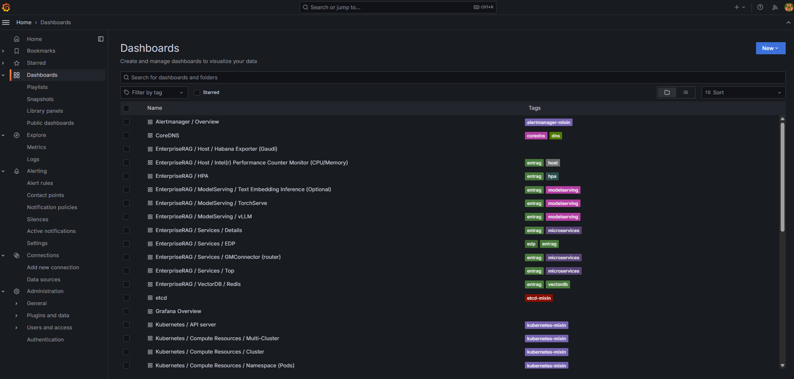
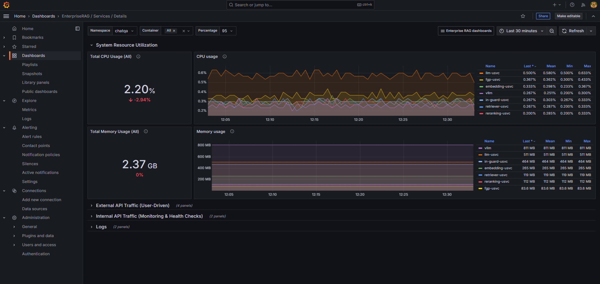
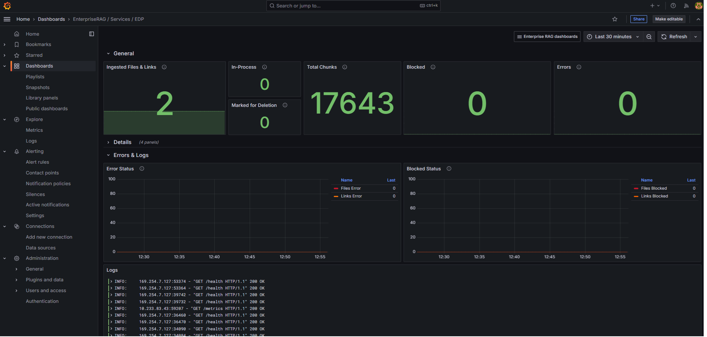
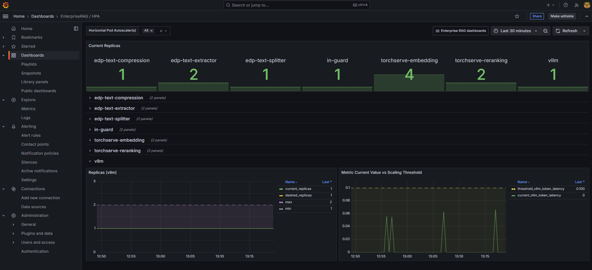
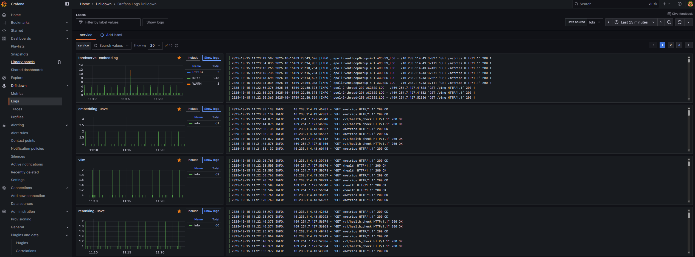

# Intel® AI for Enterprise RAG Telemetry

## Table of Contents

- [Login](#login)
- [Dashboards](#dashboards)
- [Logs](#logs)

## Login

Upon visiting https://grafana.erag.com, you will be redirected to the Grafana login page where you will be asked to enter your credentials.

> [!NOTE]
> To access **Intel® AI for Enterprise RAG Telemetry**, use the one-time credentials for `GRAFANA_USERNAME` and `GRAFANA_PASSWORD` provided in `deployment/ansible-logs/default_credentials.yaml`.
>
> After first login you will be requested to change the default password.

## Dashboards

After logging in, click `Dashboards` in the left pane. You will find preconfigured dashboards that present key metrics for the Enterprise RAG solution.

The Grafana instance provides a variety of dashboards to monitor your deployment. Dashboards prefixed with `EnterpriseRAG` are tailored to display metrics and insights specific to the Intel® AI for Enterprise RAG solution and its associated services. These dashboards help you track application performance, usage statistics, and service health.

Additionally, you will find standard Kubernetes dashboards for cluster monitoring, Node Exporter dashboards for node-level metrics, OpenTelemetry Collector (OTEL) dashboards for tracing and observability, and Prometheus Overview dashboards for general system metrics. Together, these dashboards offer a comprehensive view of both application-level and infrastructure-level telemetry, enabling effective monitoring and troubleshooting.

Below is a description of some of the dashboards. Even if a dashboard is not described here, you can click the “i” icon on any visualization to see details about what it represents.

### Dashboard `EnterpriseRAG / Services / Details`

This dashboard offers a concise overview of resource usage and service activity for your selected namespace and services. 

Key panels include:

- **System Resource Utilization:** Monitor CPU and memory usage for each service.
- **External API Traffic:** View user-facing requests, including service, method, endpoint, request rate, and P95 duration. Percentile can be adjusted.
- **Internal API Traffic:** Track monitoring and health-check requests, independent of user activity.
- **Logs:** See recent log entries, filterable by namespace or service. For deeper log analysis, it is recommended to use Grafana’s built-in Logs feature in Explore, available in the left-hand panel.

### Dashboard `EnterpriseRAG / Services / EDP`

This dashboard displays metrics from the [Enhanced DataPrep (EDP) Service](../src/edp/README.md), providing an overview of the documents and links that have been ingested into the RAG system and their current statuses.

Key panels include:

- **General:** Shows overall statistics, including the number of ingested files and links, total chunks, blocked documents (e.g., containing unsafe content), and files currently in an error state.
- **Details:** Trends for total files, links, and chunks over time.
- **Errors and Logs:** Registered errors over time and recent logs.
- **Stage Overview:** Timeline showing the number of items in each processing stage (e.g., embedding, input guard scanning, etc.).

### Dashboard `EnterpriseRAG / HPA`

This dashboard provides insights into the [Horizontal Pod Autoscaler (HPA)](../deployment/components/hpa/README.md) activity, helping to monitor how HPA responds to workload changes and taken scaling actions over time.

The top panel shows the current replica count for each service managed by HPA. Below, each service has a section displaying replica changes over time along with the metric used for scaling decisions, including its current value and the threshold that triggers scaling events.

## Logs

In the left-hand panel, select the **Explore -> Logs** tab to access Grafana’s integrated log exploration feature. Here you can view, search, and filter logs.

It supports advanced filtering, real-time log streaming, and contextual log inspection to streamline troubleshooting and monitoring. For more information on using this powerful tool, see [Grafana Explore Logs documentation](https://grafana.com/docs/grafana/latest/explore/logs-integration/).
 

