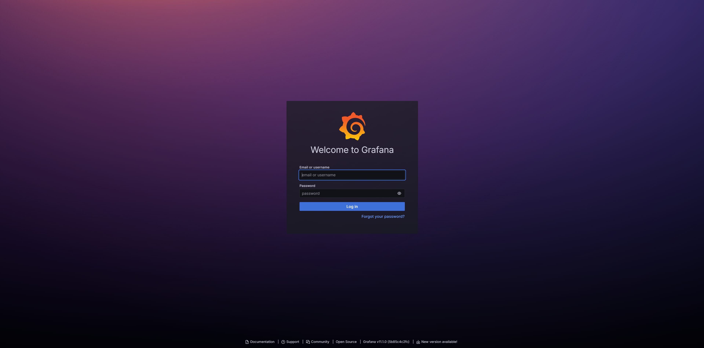
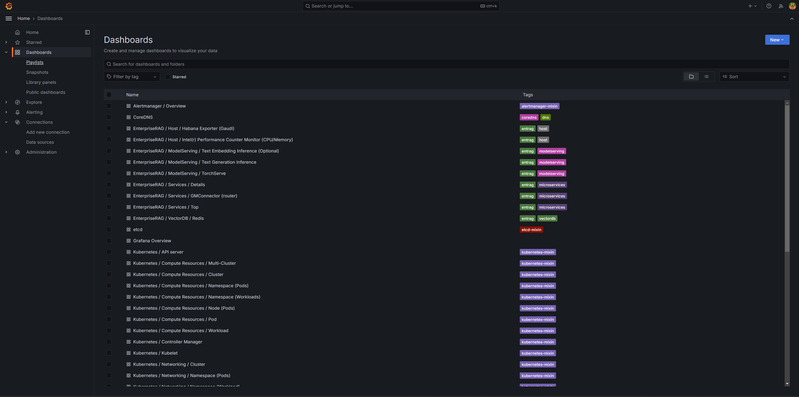

# Enteprise RAG Telemetry

## Validating Access
Enterprise RAG provides telemetry via Graphana dashboards. To access the dashboards, please follow the instructions outlined in the [Getting Started](./getting_started.md) guide under the `Accessing the UI` section.

Upon visiting `https://grafana.erag.com`, you should observe the following UI layout:

**_NOTE!_**
Please ask Enterprise RAG team for credentials to access Grafana.

### Dashboards

After logging in, click on `Dashboards` in the left pane to see detailed telemetry for all the services in the Enterprise RAG solution:

