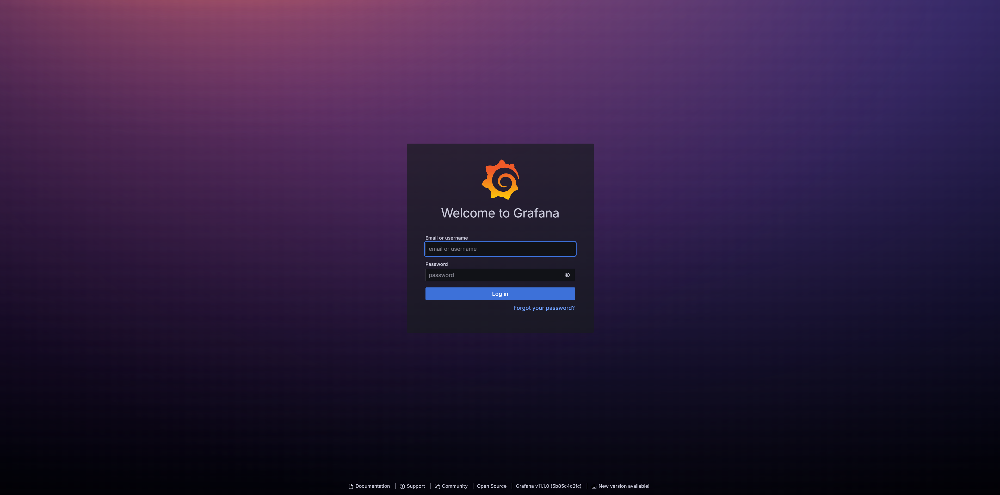
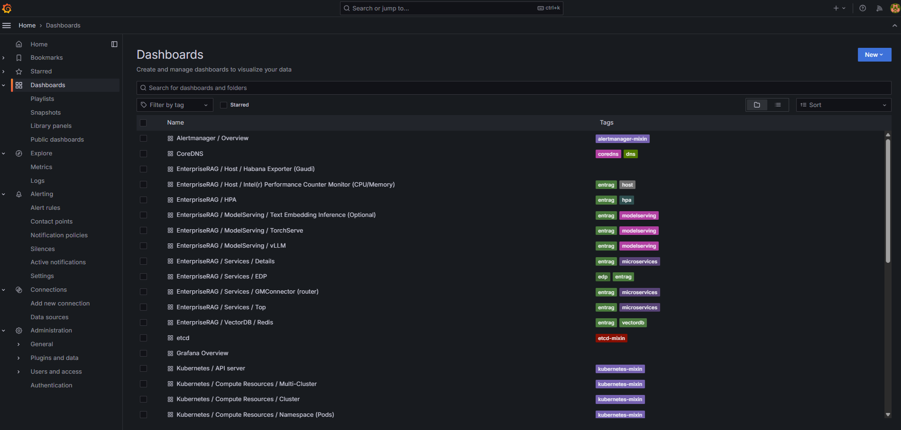
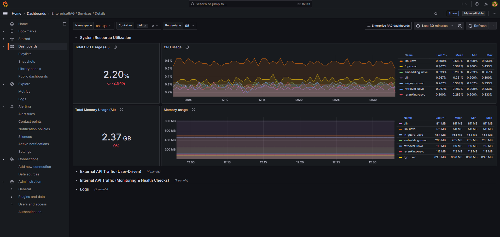
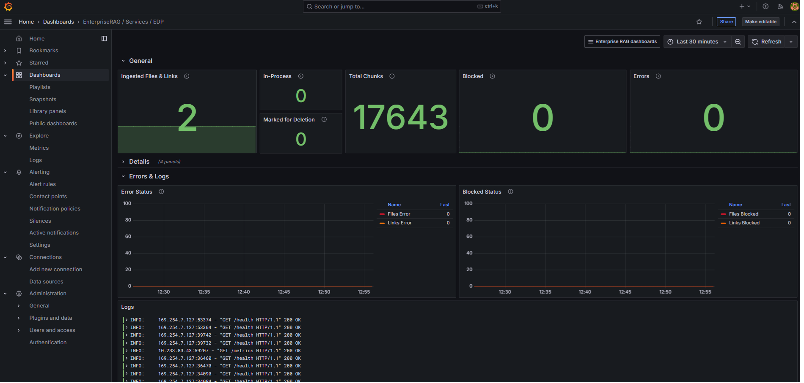
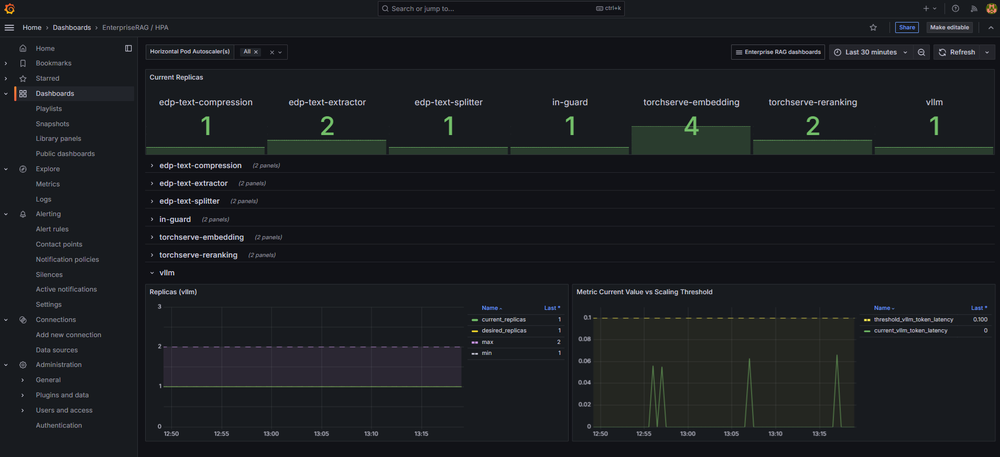
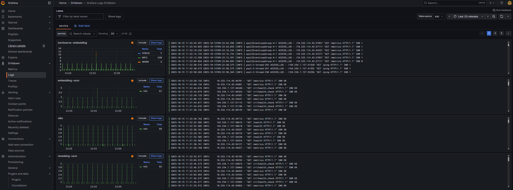
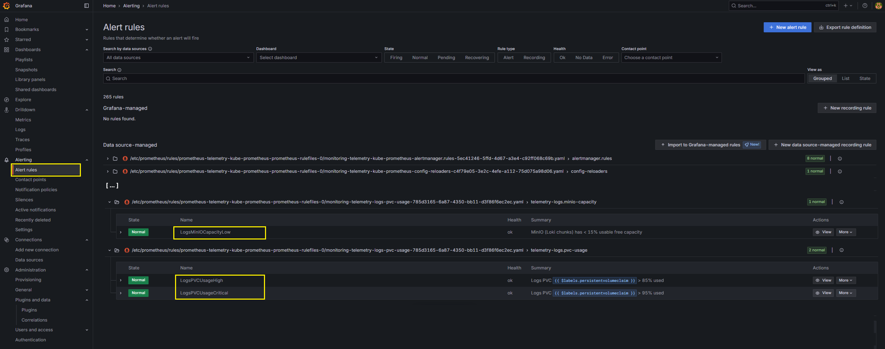

# Intel® AI for Enterprise RAG Telemetry

## Table of Contents

- [Login](#login)
- [Dashboards](#dashboards)
- [Logs](#logs)
  - [Log retention (Loki)](#log-retention-loki)
  - [PVC usage alerts](#pvc-usage-alerts)
  - [Sending alert notifications from Grafana](#sending-alert-notifications-from-grafana)
  - [What to do when the logs PVC is filling up](#what-to-do-when-the-logs-pvc-is-filling-up)

## Login

Upon visiting https://grafana.erag.com, you will be redirected to the Grafana login page where you will be asked to enter your credentials.



> [!NOTE]
> To access **Intel® AI for Enterprise RAG Telemetry**, use the one-time credentials for `GRAFANA_USERNAME` and `GRAFANA_PASSWORD` provided in `deployment/ansible-logs/default_credentials.yaml`.
>
> After first login you will be requested to change the default password.


## Dashboards

After logging in, click `Dashboards` in the left pane. You will find preconfigured dashboards that present key metrics for the Enterprise RAG solution.



The Grafana instance provides a variety of dashboards to monitor your deployment. Dashboards prefixed with `EnterpriseRAG` are tailored to display metrics and insights specific to the Intel® AI for Enterprise RAG solution and its associated services. These dashboards help you track application performance, usage statistics, and service health.

Additionally, you will find standard Kubernetes dashboards for cluster monitoring, Node Exporter dashboards for node-level metrics, OpenTelemetry Collector (OTEL) dashboards for tracing and observability, and Prometheus Overview dashboards for general system metrics. Together, these dashboards offer a comprehensive view of both application-level and infrastructure-level telemetry, enabling effective monitoring and troubleshooting.

Below is a description of some of the dashboards. Even if a dashboard is not described here, you can click the “i” icon on any visualization to see details about what it represents.


### Dashboard `EnterpriseRAG / Services / Details`

This dashboard offers a concise overview of resource usage and service activity for your selected namespace and services. 



Key panels include:

- **System Resource Utilization:** Monitor CPU and memory usage for each service.
- **External API Traffic:** View user-facing requests, including service, method, endpoint, request rate, and P95 duration. Percentile can be adjusted.
- **Internal API Traffic:** Track monitoring and health-check requests, independent of user activity.
- **Logs:** See recent log entries, filterable by namespace or service. For deeper log analysis, it is recommended to use Grafana’s built-in Logs feature in Explore, available in the left-hand panel.


### Dashboard `EnterpriseRAG / Services / EDP`

This dashboard displays metrics from the [Enhanced DataPrep (EDP) Service](../src/edp/README.md), providing an overview of the documents and links that have been ingested into the RAG system and their current statuses.



Key panels include:

- **General:** Shows overall statistics, including the number of ingested files and links, total chunks, blocked documents (e.g., containing unsafe content), and files currently in an error state.
- **Details:** Trends for total files, links, and chunks over time.
- **Errors and Logs:** Registered errors over time and recent logs.
- **Stage Overview:** Timeline showing the number of items in each processing stage (e.g., embedding, input guard scanning, etc.).


### Dashboard `EnterpriseRAG / HPA`

This dashboard provides insights into the [Horizontal Pod Autoscaler (HPA)](../deployment/components/hpa/README.md) activity, helping to monitor how HPA responds to workload changes and taken scaling actions over time.



The top panel shows the current replica count for each service managed by HPA. Below, each service has a section displaying replica changes over time along with the metric used for scaling decisions, including its current value and the threshold that triggers scaling events.


## Logs

In the left-hand panel, select the **Drilldown -> Logs** tab to access Grafana’s integrated log exploration feature. Here you can view, search, and filter logs.



It supports advanced filtering, real-time log streaming, and contextual log inspection to streamline troubleshooting and monitoring. For more information on using this powerful tool, see [Grafana Logs Drilldown documentation](https://grafana.com/docs/grafana-cloud/visualizations/simplified-exploration/logs/get-started/).

### Log retention (Loki)

Logs ingested by the OpenTelemetry collector are stored in Loki (single-binary
mode) and the chunks themselves live in a bundled MinIO that the Loki Helm
chart provisions automatically. Two settings on Loki control how long logs
are kept and how much disk MinIO is allowed to consume; both are exposed via
the inventory `config.yaml` consumed by `ansible-playbook ... --tags install`.

```yaml
telemetry:
  enabled: true
  logging:
    enabled: true
    # Loki log retention policy.
    # `enabled: true`  -> installer turns on Loki's compactor-based retention
    #                     and sets limits_config.retention_period = <retentionHours>h.
    # `enabled: false` -> retention is disabled and logs are kept forever
    #                     (until the MinIO PVC fills up).
    # `retentionHours` default 744 = 31 days, matching Loki's own built-in
    # default for limits_config.retention_period.
    retention:
      enabled: true
      retentionHours: 744
    # PVC size for each MinIO drive that stores Loki chunks. The chart uses
    # 2 drives per MinIO replica (erasure-code requirement), so the usable
    # raw object-store capacity is approximately 2 * objectStoreSize.
    objectStoreSize: 20Gi
```

> [!IMPORTANT]
> **Minimum retention period is 24 hours.** Loki groups logs into daily index tables (period: 24h) and deletes entire tables, not individual entries. Setting `retentionHours` below 24 will still result in logs being retained for at least 24 hours. For true sub-24h retention, consider using manual deletion via the Delete API (requires `deletion_mode: filter-and-delete`).

How big should `objectStoreSize` be? A useful rule of thumb for the bundled
single-binary deployment with `chunk_encoding: snappy` (~12% compression) and
31-day retention is:

```
objectStoreSize [GiB] ≈ ingest_GB_per_day × 2.7
```

To measure your actual ingest after the cluster has been running under a
realistic workload for at least 24–48 h, open Grafana → **Explore** with the
Prometheus datasource and run:

```promql
# average ingest in GB/day, last 24 h
sum(rate(loki_distributor_bytes_received_total[24h])) * 86400 / 1e9

# total chunk bytes currently stored on MinIO (after compression)
sum(loki_chunk_store_stored_chunks_bytes_total) / 1e9

# free capacity reported by MinIO (accounts for erasure-code overhead)
minio_cluster_capacity_usable_free_bytes / 1e9
```

For other retention periods scale by `retentionHours / 744`.

For background on Loki's storage layout and compactor-driven retention, see
the upstream documentation:

- [Loki – Configuration: `limits_config`](https://grafana.com/docs/loki/latest/configure/#limits_config)
- [Loki – Configuration: `compactor`](https://grafana.com/docs/loki/latest/configure/#compactor)
- [Loki – Storage retention](https://grafana.com/docs/loki/latest/operations/storage/retention/)

### PVC usage alerts

The `logs` Helm chart ships a `PrometheusRule`
(`telemetry-logs-pvc-usage`) that fires three alerts whenever the Loki/MinIO
PVCs start filling up. Thresholds are intentionally hardcoded so they always
fire early enough for an operator to react before Loki begins rejecting
ingest:

| Alert | Trigger | Sustained for | Severity |
|---|---|---|---|
| `LogsPVCUsageHigh` | Loki or MinIO PVC > **85%** used | 10 min | warning |
| `LogsPVCUsageCritical` | Loki or MinIO PVC > **95%** used | 5 min | critical |
| `LogsMinIOCapacityLow` | MinIO usable free capacity < **15%** | 15 min | warning |

The rules are scoped to the PVCs `storage-telemetry-logs-loki-*` and
`data-telemetry-logs-minio-*` in the `monitoring` namespace, so they do not
generate noise for unrelated workloads.

You can verify the rule is loaded by Prometheus:

```bash
kubectl -n monitoring get prometheusrule telemetry-logs-pvc-usage
kubectl -n monitoring port-forward svc/telemetry-kube-prometheus-prometheus 9090:9090
# open http://localhost:9090/alerts and filter for "LogsPVC" / "LogsMinIO"
```

The alerts also appear automatically in Grafana under **Alerting → Alert
rules** because Grafana uses the same Prometheus datasource.



### Sending alert notifications from Grafana

The PVC alerts above are visible in the Prometheus / Alertmanager / Grafana
UIs by default, but the bundled Alertmanager is shipped **without any
notification receivers** configured. To actually receive an email/Slack/Teams
message when an alert fires, add a contact point in Grafana:

1. Open Grafana → **Alerting → Contact points → + Add contact point**.
2. Pick an integration (Email, Slack, Microsoft Teams, Webhook,
   PagerDuty, …) and fill in its parameters (e.g. a Slack incoming-webhook
   URL).
3. Click **Test** to verify the integration, then **Save**.
4. Go to **Alerting → Notification policies → Edit default policy** and set
   **Default contact point** to the one you just created. Save.
5. Open **Alerting → Alert rules** to confirm `LogsPVCUsageHigh`,
   `LogsPVCUsageCritical` and `LogsMinIOCapacityLow` are listed (they are
   provisioned automatically by the `logs` chart).

> [!NOTE]
> The Email integration additionally requires a working SMTP configuration
> on the Grafana pod (`grafana.smtp.*` Helm values). If you only need
> notifications without changing the deployment, prefer Slack / Teams /
> Webhook, which work out of the box once the contact point is added.

For more options, see the upstream
[Grafana Alerting documentation](https://grafana.com/docs/grafana/latest/alerting/).

### What to do when the logs PVC is filling up

When `LogsPVCUsageHigh` (or `LogsMinIOCapacityLow`) fires, you have three
realistic options. They are listed in the order you should generally try
them.

#### 1. Increase `objectStoreSize` (recommended)

This is the only option that actually solves the problem instead of papering
over it. Adjust `telemetry.logging.objectStoreSize` in your inventory
`config.yaml` to the value you computed in
[Log retention](#log-retention-loki):

```yaml
telemetry:
  logging:
    objectStoreSize: 50Gi    # was 20Gi; raise based on the formula above
```

Then either:

- **Fresh installs:** rerun the installer, the PVC is created at the new
  size automatically.

  ```bash
  ansible-playbook playbooks/application.yaml \
    -e @inventory/<env>/config.yaml \
    --tags install
  ```

- **Existing clusters:** `helm upgrade` does **not** resize an existing PVC
  (this is a Kubernetes limitation, not a chart bug). If your StorageClass
  has `allowVolumeExpansion: true`, expand the PVCs in place:

  ```bash
  kubectl get sc -o custom-columns=NAME:.metadata.name,EXPAND:.allowVolumeExpansion

  for pvc in data-telemetry-logs-minio-0 data-telemetry-logs-minio-1; do
    kubectl -n monitoring patch pvc "$pvc" \
      -p '{"spec":{"resources":{"requests":{"storage":"50Gi"}}}}'
  done
  kubectl -n monitoring rollout restart statefulset telemetry-logs-minio
  ```

  If the StorageClass does **not** support online expansion you have to
  reinstall the logs stack from scratch (see option 3 below), which loses
  history.

#### 2. Lower the retention period

If you cannot grow the disk right now, shorten how long Loki keeps logs.
This is non-destructive (no `helm uninstall`), but the freed-up space only
materialises after the Loki compactor runs (typically within 1 hour of the
upgrade):

```yaml
telemetry:
  logging:
    retention:
      enabled: true
      retentionHours: 168    # was 744 (31 days); 168 = 7 days
```

```bash
ansible-playbook playbooks/application.yaml \
  -e @inventory/<env>/config.yaml \
  --tags install
```

This is the right knob if your storage is fixed (capacity quota, small
local disks) and you can live with a shorter audit window. Combine it with
option 1 once more storage becomes available.

#### 3. Wipe existing logs

> [!WARNING]
> This **does not solve the problem long-term** — without raising
> `objectStoreSize` or lowering `retentionHours` the PVC will simply fill up
> again at the same rate. Use this only as an emergency stop-gap, then
> follow up with option 1 or 2.

Two variants:

**3a. Reinstall the logs subchart (drops MinIO and Loki PVCs):**

```bash
helm -n monitoring uninstall telemetry-logs
kubectl -n monitoring delete pvc -l app.kubernetes.io/instance=telemetry-logs
ansible-playbook playbooks/application.yaml \
  -e @inventory/<env>/config.yaml \
  --tags install
```

**3b. Empty the MinIO `chunks` bucket without uninstalling Loki:**

```bash
kubectl -n monitoring exec -it telemetry-logs-minio-0 -- \
  mc alias set local http://localhost:9000 logs-user supersecretpassword
kubectl -n monitoring exec -it telemetry-logs-minio-0 -- \
  mc rm --recursive --force --dangerous local/chunks
kubectl -n monitoring rollout restart statefulset telemetry-logs-loki
```

Both variants are irreversible and lose all log history.

#### 4. Manual deletion via Loki Delete API (requires explicit enablement)

For fine-grained, query-driven deletion (specific tenant, label selector, or
time range), Loki provides a Delete API. This feature is **disabled by
default** in the ERAG configuration (`limits_config.deletion_mode` is set to
Loki's built-in default of `disabled`).

**To enable Loki Delete API deletion:**

Add the following to the Loki configuration in
`deployment/roles/application/telemetry/tasks/main.yaml` under the
`loki.loki.limits_config` section:

```yaml
loki:
  loki:
    limits_config:
      deletion_mode: "filter-and-delete"
```

**Deletion modes:**
- `disabled` or unset (default): Delete API is disabled; retention still applies normally
- `filter-only`: Delete requests are accepted but only affect query results (log data is not physically removed from storage)
- `filter-and-delete`: Full deletion enabled; data is physically removed by the compactor

**Safety mechanism:**

The deployment includes a safety delay (`retention_delete_delay: 2h`) that
prevents immediate deletion. Delete requests are queued for 2 hours before
the compactor processes them, giving administrators time to cancel accidental
deletions.

**Using the Delete API:**

Once enabled, you can delete logs matching a specific query:

```bash
# Port-forward to Loki gateway
kubectl port-forward -n monitoring svc/telemetry-logs-loki-gateway 8080:80

# Create a delete request (note: URL encoding required for curly braces)
curl -X POST -H "X-Scope-OrgID: entrag" \
"http://localhost:8080/loki/api/v1/delete?query=\{service_name=\"reranking-usvc\"\}&start=$(date -u -d '30 days ago' +%s)&end=$(date -u -d '1 days ago' +%s)"

# List pending delete requests
curl -H "X-Scope-OrgID: entrag" \
  "http://localhost:8080/loki/api/v1/delete"

# Cancel a delete request (within the 2h delay window)
curl -X DELETE -H "X-Scope-OrgID: entrag" \
  "http://localhost:8080/loki/api/v1/delete?request_id=<request_id>"
```

For more details on the Delete API and deletion modes, see:
- [Loki – Delete log entries](https://grafana.com/docs/loki/latest/operations/storage/logs-deletion/)
- [Loki – `limits_config.deletion_mode`](https://grafana.com/docs/loki/latest/configure/#limits_config)
