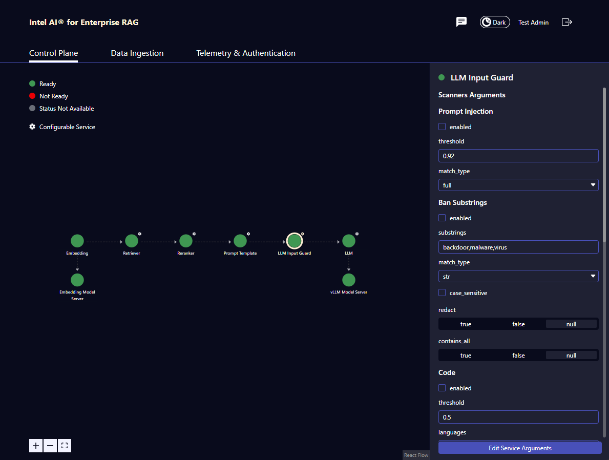

# LLM Guard Input Guardrail Microservice
This microservice implements [LLM Guard](https://protectai.github.io/llm-guard/) (version: 0.3.16) Input Scanners as part of the pipeline. The goal is to enable Secure AI and privacy-related capabilities for Enterprise RAG. Input scanners scan the incoming prompt and context before they are passed to LLM and inform the user whether they are valid.

LLM Guard Input Guardrail Microservice enables several scanners provided by LLM Guard:
 - [Anonymize](#anonymize-scanner)
 - [BanSubstrings](#bansubstrings-scanner)
 - [BanTopics](#bantopics-scanner)
 - [Code](#code-scanner)
 - [InvisibleText](#invisibletext-scanner)
 - [PromptInjection](#promptinjection-scanner)
 - [Regex](#regex-scanner)
 - [Secrets](#secrets-scanner)
 - [Sentiment](#sentiment-scanner)
 - [TokenLimit](#tokenlimit-scanner)
 - [Toxicity](#toxicity-scanner)

A detailed description of each scanner is available on [LLM Guard](https://protectai.github.io/llm-guard/).

## Table of Contents

1. [LLM Guard Input Guardrail Microservice](#llm-guard-input-guardrail-microservice)
2. [Configuration Options](#configuration-options)
   - 2.1. [Configuration via UI](#configuration-via-ui)
   - 2.2. [Configuration via environmental variables](#configuration-via-environmental-variables)
   - 2.3. [Anonymize scanner](#anonymize-scanner)
   - 2.4. [BanSubstrings scanner](#bansubstrings-scanner)
   - 2.5. [BanTopics scanner](#bantopics-scanner)
   - 2.6. [Code scanner](#code-scanner)
   - 2.7. [InvisibleText scanner](#invisibletext-scanner)
   - 2.8. [PromptInjection scanner](#promptinjection-scanner)
   - 2.9. [Regex scanner](#regex-scanner)
   - 2.10. [Secrets scanner](#secrets-scanner)
   - 2.11. [Sentiment scanner](#sentiment-scanner)
   - 2.12. [TokenLimit scanner](#tokenlimit-scanner)
   - 2.13. [Toxicity scanner](#toxicity-scanner)
3. [Getting Started](#getting-started)
   - 3.1. [Prerequisites](#prerequisites)
   - 3.2. [🚀 Start LLM Guard Input Guardrail Microservice with Python (Option 1)](#-start-llm-guard-input-guardrail-microservice-with-python-option-1)
     - 3.2.1. [Install Requirements](#install-requirements)
     - 3.2.2. [Start Microservice](#start-microservice)
   - 3.3. [🚀 Start LLM Guard Input Guardrail Microservice with Docker (Option 2)](#-start-llm-guard-input-guardrail-microservice-with-docker-option-2)
     - 3.3.1. [Build the Docker image](#build-the-docker-image)
     - 3.3.2. [Run the Docker container](#run-the-docker-container)
   - 3.4. [Verify the LLM Guard Input Guardrail Microservice](#verify-the-llm-guard-input-guardrail-microservice)
     - 3.4.1. [Check Status](#check-status)
     - 3.4.2. [Scanning using previously enabled scanners](#scanning-using-previously-enabled-scanners-for-example-via-environmental-variables-or-while-no-scanner-enabled)
     - 3.4.3. [Changing scanners configuration via requests](#changing-scanners-configuration-via-requests)
   - 3.5. [Project Structure](#project-structure)

## Configuration Options

### Configuration via UI
Most of the scanners you can configure from Admin Panel available in UI(applicable for ChatQnA pipeline only). The Panel looks as follows:



Scanners currently configurable from Admin Panel:
 - [PromptInjection](#promptinjection-scanner) - partially configurable
 - [BanSubstrings](#bansubstrings-scanner) - fully configurable
 - [Code](#code-scanner) - partially configurable
 - [InvisibleText](#invisibletext-scanner) - fully configurable
 - [Regex](#regex-scanner) - partially configurable
 - [Secrets](#secrets-scanner) - fully configurable
 - [Sentiment](#sentiment-scanner) - partially configurable
 - [TokenLimit](#tokenlimit-scanner) - partially configurable
 - [Toxicity](#toxicity-scanner) - partially configurable

Default configurations for UI can be found in the file [object_document_mapper.py](../../system_fingerprint/utils/object_document_mapper.py).

### Configuration via environmental variables
The LLM Guard Input Guardrail Microservice configuration is specified in the [impl/microservice/.env](impl/microservice/.env) file. You can adjust these settings by modifying this dotenv file or exporting environmental variables as parameters to the container/pod. Each scanner can be configured in the .env file. Enabled scanners are executed sequentially. The environmental variables that are required for default run of particular scanner have values provided in .env file. Without providing them scanner will not work. The variables that do not have any values are optional, and without providing any values default values will be passed to scanner constructor.

### Anonymize scanner
Detailed description of the scanner can be found in [LLM Guard documentation for Anonymize scanner](https://protectai.github.io/llm-guard/input_scanners/anonymize/)
| Environment Variable       | Description                                                     | Type   | Default in LLM Guard  | Required / Optional | Available in Chatqna's UI |
|----------------------------|-----------------------------------------------------------------|--------|-----------------------|---------------------|---------------------|
| `ANONYMIZE_ENABLED`        | Enables Anonymize scanner.                                      | bool   | false               | Required            | No |
| `ANONYMIZE_USE_ONNX`       | Enables usage of ONNX optimized model for Anonymize scanner.    | bool   | false                | Required            | No |
| `ANONYMIZE_HIDDEN_NAMES`   | List of names to be anonymized e.g. [REDACTED_CUSTOM_1].        | string | no value              | Optional            | No |
| `ANONYMIZE_ALLOWED_NAMES`  | List of names allowed in the text without anonymizing.          | string | no value              | Optional            | No |
| `ANONYMIZE_ENTITY_TYPES`   | List of entity types to be detected.                            | string | no value              | Optional            | No |
| `ANONYMIZE_PREAMBLE`       | Text to be added before sanitized prompt.                       | string | no value              | Optional            | No |
| `ANONYMIZE_REGEX_PATTERNS` | Custom regex patterns for anonymization.                        | string | no value              | Optional            | No |
| `ANONYMIZE_USE_FAKER`      | Enables usage of Faker library for generating fake data.        | bool   | false               | Optional            | No |
| `ANONYMIZE_RECOGNIZER_CONF`| Configuration for entity recognizers.                           | string | no value              | Optional            | No |
| `ANONYMIZE_THRESHOLD`      | Acceptance threshold for anonymization.                         | float  | no value              | Optional            | No |
| `ANONYMIZE_LANGUAGE`       | Language model to be used for anonymization.                    | string | no value              | Optional            | No |

### BanSubstrings scanner
Detailed description of the scanner can be found in [LLM Guard documentation for BanSubstrings scanner](https://protectai.github.io/llm-guard/input_scanners/ban_substrings/)
| Environment Variable       | Description                                                                   | Type   | Default in LLM Guard  | Required / Optional | Available in Chatqna's UI |
|----------------------------|-------------------------------------------------------------------------------|--------|-----------------------|---------------------|---------------------|
| `BAN_SUBSTRINGS_ENABLED`   | Enables BanSubstrings scanner.                                                | bool   | false               | Required            | Yes |
| `BAN_SUBSTRINGS_SUBSTRINGS`| List of substrings to be banned.                                              | string(list can be also in one string with elements separated with commas)/List[string] | "backdoor,malware,virus"| Required            | Yes |
| `BAN_SUBSTRINGS_MATCH_TYPE`| Match type for substrings.                                                    | string | "str"                 | Optional            | Yes |
| `BAN_SUBSTRINGS_CASE_SENSITIVE` | Enables case sensitivity for detecting substrings.                       | bool   | false               | Optional            | Yes |
| `BAN_SUBSTRINGS_REDACT`    | Enables redaction of banned substrings.                                       | bool   | false               | Optional            | Yes |
| `BAN_SUBSTRINGS_CONTAINS_ALL` | Requires all substrings to be present.                                     | bool   | false               | Optional            | Yes |

### BanTopics scanner
Detailed description of the scanner can be found in [LLM Guard documentation for BanTopics scanner](https://protectai.github.io/llm-guard/input_scanners/ban_topics/)
| Environment Variable       | Description                                                  | Type   | Default in LLM Guard  | Required / Optional | Available in Chatqna's UI |
|----------------------------|--------------------------------------------------------------|--------|-----------------------|---------------------|---------------------|
| `BAN_TOPICS_ENABLED`       | Enables BanTopics scanner.                                   | bool   | false               | Required            | No |
| `BAN_TOPICS_USE_ONNX`      | Enables usage of ONNX optimized model for BanTopics scanner. | bool   | false                | Required            | No |
| `BAN_TOPICS_TOPICS`        | List of topics to be banned.                                 | string(list can be also in one string with elements separated with commas)/List[string] | "violence,attack,war" | Required            | No |
| `BAN_TOPICS_THRESHOLD`     | Threshold for BanTopics scanner.                             | float  | 0.6                   | Optional            | No |
| `BAN_TOPICS_MODEL`         | Model to be used for BanTopics scanner.                      | string | none            | Optional            | No |

### Code scanner
Detailed description of the scanner can be found in [LLM Guard documentation for Code scanner](https://protectai.github.io/llm-guard/input_scanners/code/)
| Environment Variable       | Description                                                 | Type   | Default in LLM Guard  | Required / Optional | Available in Chatqna's UI |
|----------------------------|-------------------------------------------------------------|--------|-----------------------|---------------------|---------------------|
| `CODE_ENABLED`             | Enables Code scanner.                                       | bool   | false               | Required            | Yes |
| `CODE_USE_ONNX`            | Enables usage of ONNX optimized model for Code scanner.     | bool   | false                | Required            | No |
| `CODE_LANGUAGES`           | List of programming languages to be detected.               | string(list can be also in one string with elements separated with commas)/List[string] | "Java,Python"         | Required            | Yes |
| `CODE_MODEL`               | Model to be used for Code scanner.                          | string | none       | Optional            | No |
| `CODE_IS_BLOCKED`          | Enables blocking of detected code.                          | bool   | true               | Optional            | No |
| `CODE_THRESHOLD`           | Threshold for Code scanner.                                 | float  | 0.5                   | Optional            | Yes |

### InvisibleText scanner
Detailed description of the scanner can be found in [LLM Guard documentation for InvisibleText scanner](https://protectai.github.io/llm-guard/input_scanners/invisible_text/)
| Environment Variable       | Description                    | Type   | Default in LLM Guard  | Required / Optional | Available in Chatqna's UI |
|----------------------------|--------------------------------|--------|-----------------------|---------------------|---------------------|
| `INVISIBLE_TEXT_ENABLED`   | Enables InvisibleText scanner. | bool   | false               | Required            | Yes |

### PromptInjection scanner
Detailed description of the scanner can be found in [LLM Guard documentation for PromptInjection scanner](https://protectai.github.io/llm-guard/input_scanners/prompt_injection/)
| Environment Variable          | Description                                                        | Type   | Default in LLM Guard  | Required / Optional | Available in Chatqna's UI |
|-------------------------------|--------------------------------------------------------------------|--------|-----------------------|---------------------|---------------------|
| `PROMPT_INJECTION_ENABLED`    | Enables PromptInjection scanner.                                   | bool   | false               | Required            | Yes |
| `PROMPT_INJECTION_USE_ONNX`   | Enables usage of ONNX optimized model for PromptInjection scanner. | bool   | false                | Required            | No |
| `PROMPT_INJECTION_MODEL`      | Model to be used for PromptInjection scanner.                      | string | none            | Optional            | No |
| `PROMPT_INJECTION_THRESHOLD`  | Threshold for PromptInjection scanner.                             | float  | 0.92                  | Optional            | Yes |
| `PROMPT_INJECTION_MATCH_TYPE` | Match type for prompt injection detection.                         | string | "full"                | Optional            | Yes |


### Regex scanner
Detailed description of the scanner can be found in [LLM Guard documentation for Regex scanner](https://protectai.github.io/llm-guard/input_scanners/regex/)
| Environment Variable       | Description                                                                   | Type   | Default in LLM Guard  | Required / Optional | Available in Chatqna's UI |
|----------------------------|-------------------------------------------------------------------------------|--------|-----------------------|---------------------|---------------------|
| `REGEX_ENABLED`            | Enables Regex scanner.                                                        | bool   | false               | Required            | Yes |
| `REGEX_PATTERNS`           | List of regex patterns to be used.                                            | string | "Bearer [A-Za-z0-9-._~+/]+"| Required            | Yes |
| `REGEX_IS_BLOCKED`         | Enables blocking of matched patterns.                                         | bool   | true               | Optional            | No |
| `REGEX_MATCH_TYPE`         | Match type for regex patterns (e.g., full, partial).                          | string | "all"              | Optional            | Yes |
| `REGEX_REDACT`             | Enables redaction of output.                                                  | bool   | false               | Optional            | Yes |

### Secrets scanner
Detailed description of the scanner can be found in [LLM Guard documentation for Secrets scanner](https://protectai.github.io/llm-guard/input_scanners/secrets/)                                                                   |
| Environment Variable       | Description                                                                   | Type   | Default in LLM Guard  | Required / Optional | Available in Chatqna's UI |
|----------------------------|-------------------------------------------------------------------------------|--------|-----------------------|---------------------|---------------------|
| `SECRETS_ENABLED`          | Enables Secrets scanner.                                                      | bool   | false               | Required            | Yes |
| `SECRETS_REDACT_MODE`      | Redaction mode for detected secrets.                                          | string | "all"          | Optional            | Yes |

### Sentiment scanner
Detailed description of the scanner can be found in [LLM Guard documentation for Sentiment scanner](https://protectai.github.io/llm-guard/input_scanners/sentiment/)
| Environment Variable       | Description                                                                   | Type   | Default in LLM Guard  | Required / Optional | Available in Chatqna's UI |
|----------------------------|-------------------------------------------------------------------------------|--------|-----------------------|---------------------|---------------------|
| `SENTIMENT_ENABLED`        | Enables Sentiment scanner.                                                    | bool   | false               | Required            | Yes |
| `SENTIMENT_THRESHOLD`      | Threshold for Sentiment scanner.                                              | float  | -0.3                   | Optional            | Yes |
| `SENTIMENT_LEXICON`        | Lexicon to be used for sentiment analysis.                                    | string | none       | Optional            | No |

### TokenLimit scanner
Detailed description of the scanner can be found in [LLM Guard documentation for TokenLimit scanner](https://protectai.github.io/llm-guard/input_scanners/token_limit/)
| Environment Variable       | Description                                                                   | Type   | Default in LLM Guard  | Required / Optional | Available in Chatqna's UI |
|----------------------------|-------------------------------------------------------------------------------|--------|-----------------------|---------------------|---------------------|
| `TOKEN_LIMIT_ENABLED`      | Enables TokenLimit scanner.                                                   | bool   | false               | Required            | Yes |
| `TOKEN_LIMIT_LIMIT`        | Threshold for TokenLimit scanner. Default: 1000.                              | int    | 4096                  | Required            | Yes |
| `TOKEN_LIMIT_ENCODING_NAME`| Encoding name for TokenLimit scanner.                                         | string | "cl100k_base"         | Optional            | No |
| `TOKEN_LIMIT_MODEL_NAME`   | Model name to be used for TokenLimit scanner.                                 | string | none                  | Optional            | No |

### Toxicity scanner
Detailed description of the scanner can be found in [LLM Guard documentation for Toxicity scanner](https://protectai.github.io/llm-guard/input_scanners/toxicity/)
| Environment Variable       | Description                                                                   | Type   | Default in LLM Guard  | Required / Optional | Available in Chatqna's UI |
|----------------------------|-------------------------------------------------------------------------------|--------|-----------------------|---------------------|---------------------|
| `TOXICITY_ENABLED`         | Enables Toxicity scanner.                                                     | bool   | false               | Required            | Yes |
| `TOXICITY_USE_ONNX`        | Enables usage of ONNX optimized model for Toxicity scanner.                   | bool   | false                | Required            | No |
| `TOXICITY_MODEL`           | Model to be used for Toxicity scanner.                                        | string | none       | Optional            | No |
| `TOXICITY_THRESHOLD`       | Threshold for Toxicity scanner.                                               | float  | 0.5                   | Optional            | Yes |
| `TOXICITY_MATCH_TYPE`      | Match type for toxicity detection.                                            | string | "full"                | Optional            | Yes |

## Getting started

### Prerequisites

1. **Navigate to the microservice directory**
    ```sh
    cd src/comps/guardrails/llm_guard_input_guardrail
    ```

2. **Set up the environment variables**
    Edit the `.env` file to configure the necessary environment variables for the scanners you want to enable.

### 🚀 Start LLM Guard Input Guardrail Microservice with Python (Option 1)

To start the LLM Guard Intput Guardrail microservice, you need to install python packages first.

#### Install Requirements
To freeze the dependencies of a particular microservice, [uv](https://github.com/astral-sh/uv) project manager is utilized. So before installing the dependencies, installing uv is required.
Next, use `uv sync` to install the dependencies. This command will create a virtual environment.

```bash
pip install uv
uv sync --locked --no-cache --project impl/microservice/pyproject.toml
source impl/microservice/.venv/bin/activate
```

#### Start Microservice

```bash
python opea_llm_guard_input_guardrail_microservice.py
```

### 🚀 Start LLM Guard Input Guardrail Microservice with Docker (Option 2)

#### Build the Docker image
```sh
cd ../../.. # src/ directory
docker build -t opea/in-guard:latest -f comps/guardrails/llm_guard_input_guardrail/impl/microservice/Dockerfile .
```

#### Run the Docker container, for example
```sh
docker run -d -e BAN_SUBSTRINGS_ENABLED=true -p 8050:8050 opea/in-guard:latest
```

### Verify the LLM Guard Input Guardrail Microservice

#### Check Status
```bash
curl http://localhost:8050/v1/health_check \
  -X GET \
  -H 'Content-Type: application/json'
```

#### Scanning using previously enabled scanners (for example via environmental variables) or while no scanner enabled

##### Example input
```bash
curl http://localhost:8050/v1/llmguardinput \
  -X POST \
  -d '{
        "messages": {
                "system": "You are a helpful assistant",
                "user": "How are you?"
            },
        "max_new_tokens":17,
        "top_k":10,
        "top_p":0.95,
        "typical_p":0.95,
        "temperature":0.01,
        "repetition_penalty":1.03,
        "streaming":false
    }' \
  -H 'Content-Type: application/json'
```

##### Example output (when no scanners enabled or scanner did not catch any problem)
The output of an input guardrail microservice is a JSON object that includes the scanned texts.

```json
{
    "id":"d343573ed6be001001d505c335aa332b",
    "messages":{"id":"0949788bf8bc1853371efd8a4752cc15","system":"You are a helpful assistant","user":"How are you?"},
    "model":null,
    "max_new_tokens":17,
    "top_k":10,
    "top_p":0.95,
    "typical_p":0.95,
    "temperature":0.01,
    "repetition_penalty":1.03,
    "streaming":false,
    "input_guardrail_params":null,
    "output_guardrail_params":null
}
```

#### Changing scanners configuration via requests

##### Example input
```bash
curl http://localhost:8050/v1/llmguardinput \
  -X POST \
  -d '{"messages": {
                "system": "You are a helpful assistant.",
                "user": "What is Deep Learning?"
            },
        "max_new_tokens":17,
        "top_k":10,"top_p":0.95,
        "typical_p":0.95,
        "temperature":0.01,
        "repetition_penalty":1.03,
        "streaming":false,
        "input_guardrail_params":
            {"ban_substrings":
                {"enabled":true,
                "substrings":["backdoor","malware","virus"],
                "match_type":null,
                "case_sensitive":false,
                "redact":null,
                "contains_all":null}
            }
        }' \
  -H 'Content-Type: application/json'
```

##### Example output(when scanner blocked the prompt)
The output of an input guardrail microservice is a 466 error code JSON object that includes following message.

```bash
{
    {
        "detail":"I'm sorry, I cannot assist you with your prompt."
    }
}
```

## Additional Information

### Project Structure

The project is organized into several directories:

- `impl/`: This directory contains configuration files for the LLM Guard Input Guardrail Microservice e.g. docker files.
- `utils/`: This directory contains scripts that are used by the LLM Guard Input Guardrail Microservice.
